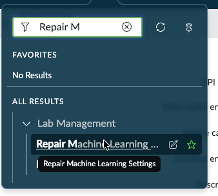

# Section A3 - AI Search Setup

Use this procedure if you need to reset and reinitialize the machine learning configuration that supports AI Search in the lab environment.

## Reset Machine Learning Settings

1. Log out of your lab instance.

2. Open a new private browsing session.

   You can use either:

   - A private browser window
   - An incognito browser window

3. In the browser address bar, remove the following portion of the URL:

   ```text
   /external_logout.do
   ```

4. Press **Enter**.

   You should be presented with the standard login page for your instance.

## Sign In with the AI Search Administrative User

5. Log in using the following credentials.

| Field | Value |
|---|---|
| User | aislab.admin |
| Password | aislab.admin |

## Run the Repair Tool

6. Navigate to:

   ```text
   All > Repair Machine Learning Settings Tool
   ```

   

7. In the right-side panel, locate:

   ```text
   Repair/Reset Machine Learning Settings
   ```

8. Click **Reset**.

9. Wait for the reset process to complete.


The repair process may take several minutes to complete before the instance is ready for use.


## Return to the Lab

10. Use your magic link to sign back in as **admin**.

