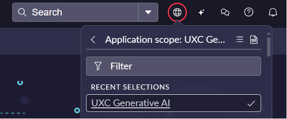
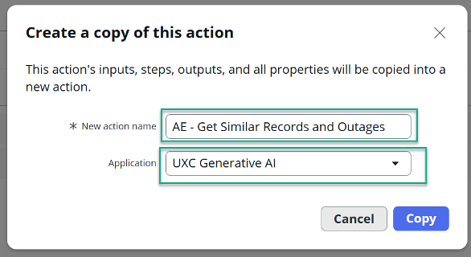

# Section A4: Application Scope | World Forums and Summits Learning Labs 2026

## section-a4-application-scope.md

> For the complete documentation index, see [llms.txt](https://servicenow-events-or-lab-guidebo.gitbook.io/world-forums-learning-labs-2026/llms.txt). Markdown versions of documentation pages are available by appending `.md` to page URLs; this page is available as [Markdown](https://servicenow-events-or-lab-guidebo.gitbook.io/world-forums-learning-labs-2026/world-forums-and-summits-learning-labs/put-ai-to-work-shop-for-service-operations/appendix/section-a4-application-scope.md).

## Section A4: Application Scope

If you couldn’t find the “Platform AI Agents and Skills” application scope, then please look for “UXC Generative AI” and create your script under it.&#x20;

And the action you are copying would be:\

&#x20;\
\\
