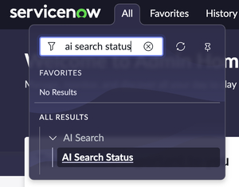

# Lab Preparation

Before starting the lab, let’s make sure your lab instance is ready.&#x20;

Log into the instance with the “Magic link” as Admin.&#x20;

Navigate to AI Search > AI Search Status

  

You should see a green check mark, like this:

  

If AI Search is NOT active, please click to go to the [Appendix Section A3: AI Search Set-Up](appendix/section-a3-ai-search-set-up.md) and follow the steps to repair your instance.&#x20;

Otherwise, proceed to the lab.

