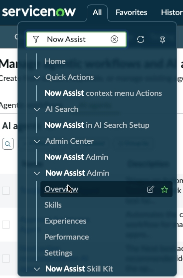
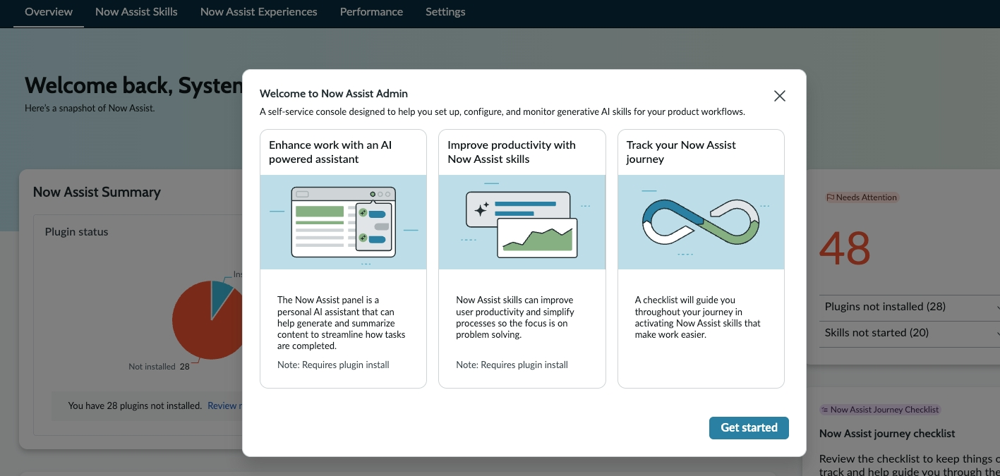
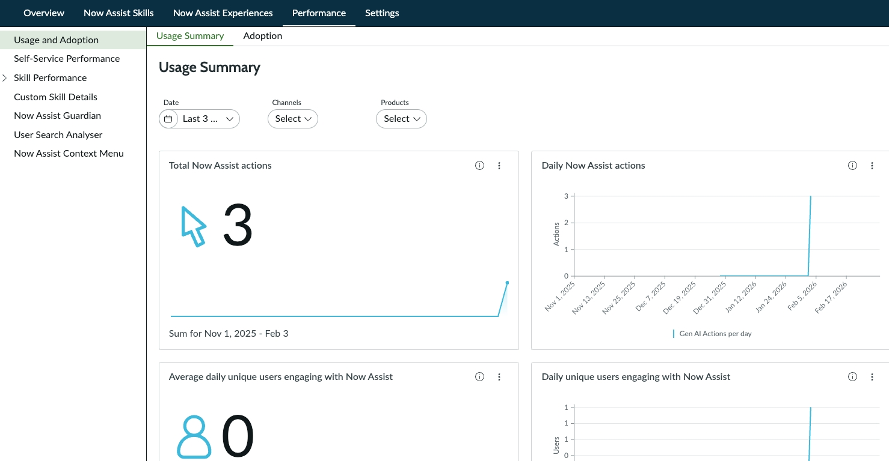
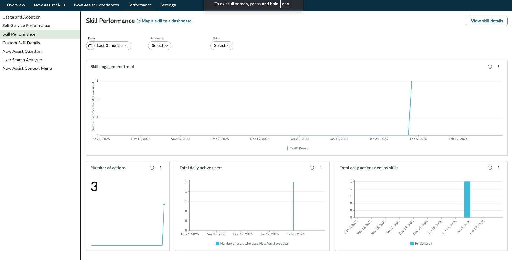

# Section 1. Start using Gen AI on Day 1 | World Forums and Summits Learning Labs 2026

For the complete documentation index, see [llms.txt](https://servicenow-events-or-lab-guidebo.gitbook.io/world-forums-learning-labs-2026/llms.txt). This page is also available as [Markdown](section-1.-start-using-gen-ai-on-day-1.md).

## Section 1. Start using Gen AI on Day 1

Now Assist was designed so customers could launch quickly and with minimal lift. Our talented product teams built Now Assist to be turnkey. With the click of a button, you're off to the GenAI races.

### Section 1.1 Tour the Now Assist Admin Console

1. Go to All > Now Assist Admin > Overview. Close the intro splash screen.

Note: This lab uses Now Assist for ITSM, ITOM, and Creator, but everything we will do mirrors what you would do for customer service cases, HR cases, work orders, etc.

2. Navigate back to the **Now Assist Admin (All > Now Assist Admin > Overview)** console and click the **Performance** tab to view the Usage and Adoption dashboards, which provide a picture of the overall health and engagement for Now Assist.

3. In the left-hand navigation menu, click **“Skill Performance”.** Use the date, products, and skills filters to change the data on view.

**Congratulations,** you have reviewed the Admin Console! Feel free to navigate the console further and ask the lab leader any questions.

[PreviousLab preparation](lab-preparation.md)[NextSection 2. Building Agents and Use Cases](section-2.md)

Last updated 5 months ago
