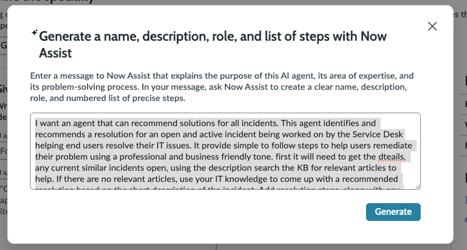
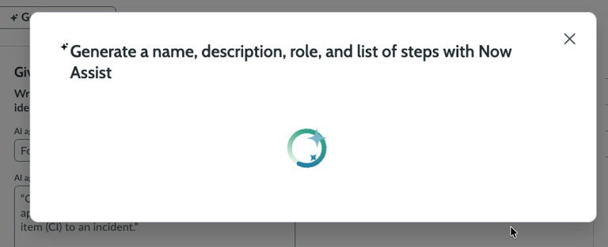
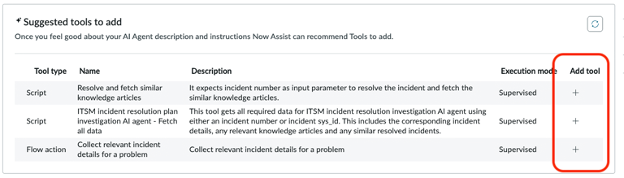
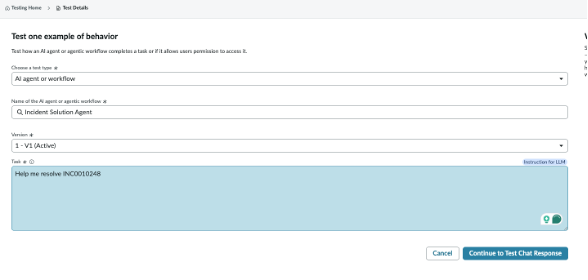
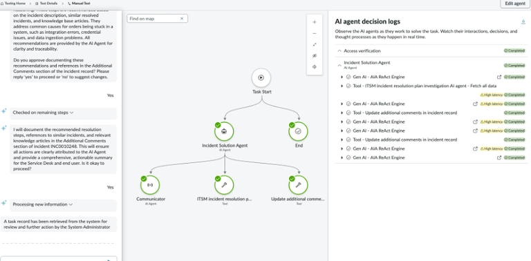

# Build an Agent with Tools

### Create the AI Agent

1.  Open **AI Agent Studio**.

    Navigate to:

    `All > AI Agent Studio > Overview`
2. Click **Create and Manage**.
3. Select the **AI Agent** tab, then click **Add**.
4. Enter the following prompt.

```
I want an agent that can recommend solutions for all incidents. This agent identifies and recommends a resolution for an open and active incident being worked on by the Service Desk, helping end users resolve their IT issues.

It should provide simple-to-follow steps to help users remediate their problem using a professional and business-friendly tone.

First, it needs to get the details and identify any current similar incidents that are open. Using the incident description, search the knowledge base for relevant articles. If there are no relevant articles, use your IT knowledge to come up with a recommended resolution based on the short description of the incident.

Add resolution steps, along with any relevant similar incidents and knowledge articles, to the Additional Comments section of the incident record. When adding a comment, include a qualifier that states the comment was added by an AI Agent.

Format the output message so it is easy to read, with new line characters in a list format. Also provide the reasoning for recommending these steps.
```

<p align="center">
  
</p>

<p align="center">
  
</p>
5.  Review the generated values.

    Verify that Now Assist populated the following:

    * AI Agent role
    * Agent name
    * List of steps
6. If the **Possible duplications found** dialog appears, click **Ignore and continue**.

### Add Recommended Tools

7. Click **Recommended Tools**.
8. Add the suggested tools in the order presented by clicking **+** next to each tool type.
9. Click **Save and Continue**.


**Note**

If you do not see the recommended tools, click **Add tool** and manually select the exact tools listed in this guide. Ask the instructor for help if needed.


<p align="center">
  
</p>

### Create the Additional Comments Tool

10. Click **Add tool**.
11. Configure the tool using the values below.

| Field          | Value                                                                                                               |
| -------------- | ------------------------------------------------------------------------------------------------------------------- |
| Tool type      | Flow Action                                                                                                         |
| Flow action    | Add Worknote                                                                                                        |
| Name           | Update additional comments in incident record                                                                       |
| Description    | Update the additional comments field in the incident record belonging to the incident that triggered this AI agent. |
| Execution mode | Autonomous                                                                                                          |
| Display output | Yes                                                                                                                 |

12. Under **Advanced**, configure the following values.

| Setting                        | Value                                                                 |
| ------------------------------ | --------------------------------------------------------------------- |
| Output transformation strategy | Concise                                                               |
| Generate messages              | Let Now Assist generate responses. Customize the messages if desired. |

13. Click **Add**.

### Create the Similar Incidents Tool

14. Click **Add tool** again.
15. Configure the tool using the values below.

| Field          | Value                                                          |
| -------------- | -------------------------------------------------------------- |
| Tool type      | Flow Action                                                    |
| Flow action    | Get Similar incident records                                   |
| Name           | Get Similar Incident Records                                   |
| Description    | Get similar incident records. The table is the incident table. |
| Execution mode | Autonomous                                                     |
| Display output | Yes                                                            |

16. Under **Advanced**, configure the following values.

| Setting                        | Value                                                                 |
| ------------------------------ | --------------------------------------------------------------------- |
| Output transformation strategy | Concise                                                               |
| Generate messages              | Let Now Assist generate responses. Customize the messages if desired. |

17. Click **Add**.
18. Click **Save and Continue**.

### Configure Security

19. In **Define security controls**, click **Save and continue**.
20. Configure user access.

| Setting     | Value                  |
| ----------- | ---------------------- |
| User access | Any Authenticated User |

21. Configure data access.

| Setting        | Value        |
| -------------- | ------------ |
| User type      | Dynamic user |
| Approved roles | itil, admin  |

### Configure Triggers, Channels, and Messages

22. In **Add triggers**, click **Save and continue**.
23. In **Select channels and status**, leave the default selections unchanged.

Agents can be enabled for Now Assist for Virtual Agent through Employee Center or Service Portal. For this lab, do not change the default selection.

24. In **Communicate this AI agent's process to users**, click **Generate messages**.
25. Review and adjust the generated messages if desired.
26. In **Activation status**, set **Status** to **On**.
27. Click **Save and Test**.

### Test the Agent

1. In the **Task** box, enter:

```
Help me resolve INC0010248
```

2. Click **Continue to Test Chat response**.

<p align="center">
  
</p>

### What to Observe

Several tools are intentionally left as human-supervised actions so you can observe the agentic thought process.

<p align="center">
  
</p>

Next, move this agent and its tools to an Agentic Workflow.
