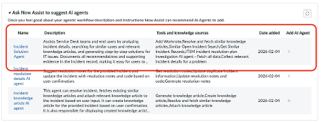

# Section 2.3 - Wrap Your Agent in an Agentic Workflow

In this exercise, you will create an Agentic Workflow that uses the AI Agent from the previous lab.

## Create the Agentic Workflow

1. Click **Create and Manage**.

2. Select the **Agentic workflows** tab.

3. Click **New**.

4. On **Define key requirements**, click **Generate details**.

5. Copy and paste the following prompt into the dialog.

```text
This workflow will be the Incident Solution Agent workflow. This use case provides recommendations to resolve incidents. Provide a recommendation on how to resolve a given incident using an easy-to-follow numbered step-by-step list format.
```

6. Click **Generate**.

7. Scroll down and review the generated fields.

## Add the AI Agent

8. Click **Recommend**.

9. Find the AI Agent you created previously.

<p align="center">
  
</p>

10. Under **Add AI agent**, click **+**.

11. If the possible duplicates prompt appears, click **Ignore and continue**.

## Configure Security

12. In **Define user access**, configure the following value.

| Setting | Value |
|---|---|
| User access | Any Authenticated User |

13. Configure data access.

| Setting | Value |
|---|---|
| User type | Dynamic user |
| Approved roles | itil, admin |

## Add a Trigger

14. On the **Add Trigger** page, click **Add Trigger**.

15. Configure the trigger using the values below.

| Field | Value |
|---|---|
| Select Trigger | Created |
| Trigger name | [Your initials] Incident Created |
| Objective | Help me resolve $(number) |
| Trigger status | On |
| Table | Incident |
| Run as | Run As User |
| Conditions | Active is True AND Assigned to is not empty |
| Sys_user | Assigned to [task] |
| Channel | Now Assist panel |
| Show alert to users | No |

16. Click **Save and continue**.

## Configure Channels and Messages

17. In **Select channels and status**, leave the default selections unchanged.

   Agents can be enabled for Now Assist for Virtual Agent through Employee Center or Service Portal. For this lab, do not change the default selection.

18. In **Communicate this AI agent's process to users**, click **Generate messages**.

19. Review the generated messages for when the agent is thinking and when the agent has completed the task.

20. Click **Add**.

21. Click **Save and Continue**.

22. On **Select channel and status**, set **Now Assist Panel Display** to **On**.

23. Click **Save and Test**.

## Test the Workflow

1. Continue using the same incident record from the previous lab.

2. In the **Task** box, enter:

```text
Help me resolve INC0010248
```

3. Click **Continue to Test Chat response**.
