# Section 2.4 - Optional: Build an AI Agent That Checks Outages in Similar Incidents

In this optional exercise, you will extend the incident solution agent so it can check for outages in similar incidents and create an outage when needed.

## Create an Outage for the Test Incident

1. Open the incidents table.

   Navigate to:

   `All > Incident > All`

2. Search for **INC0010248** and open the incident.

3. Scroll to the bottom of the page and select the **Outages** tab.

   If the tab is not visible, ask your instructor how to add it as a related list.

4. Click **New**.

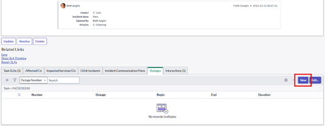

5. On the **Outage New record** page, configure the following values.

"

| Field | Value |
|---|---|
| Type | Degradation |
| Task number | INC0010248 |

6. Click **Submit**.

7. Click **Update** to return to the incidents list.

## Switch Application Scope

8. Click the application scope icon at the top of the page.

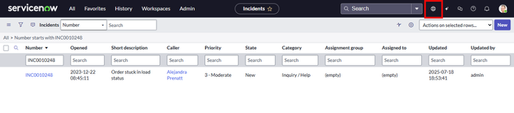"

9. Configure the following value.

| Field | Value |
|---|---|
| Application scope | Platform AI Agents and Skills |


**Note**

If you cannot find **Platform AI Agents and Skills**, refer to Appendix Section A4: Application Scope.


## Copy the Get Similar Records Action

10. Open **Flow Designer**.

    Navigate to:

    `All > Flow Designer`

    Flow Designer opens in a new tab.

11. Open the **Actions** tab.

12. Search for **Get Similar Records** and open it.


**Important**

Do not open **Get Similar Incident Records**.


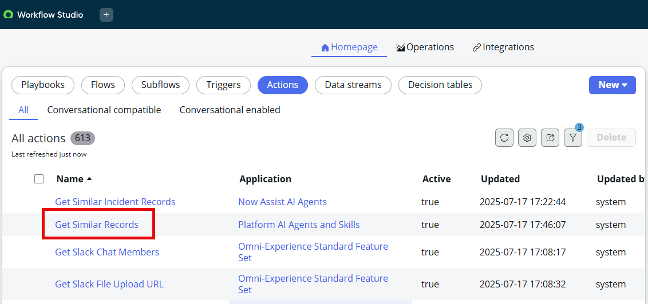"

13. Click the three-dot menu in the top-right corner.

14. Click **Copy**.

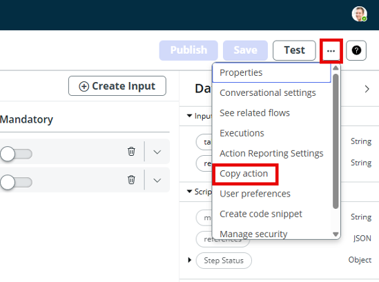"

15. Configure the copied action using the values below.

| Field | Value |
|---|---|
| Action name | [Your initials] Get Similar Records and Outages |
| Application | Platform AI Agents and Skills |

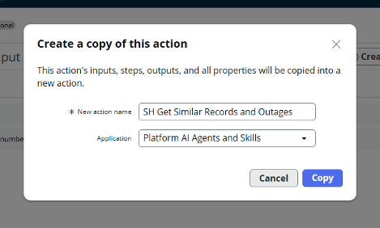"

16. Click **Copy**.

17. On the left, click **Script Step**.

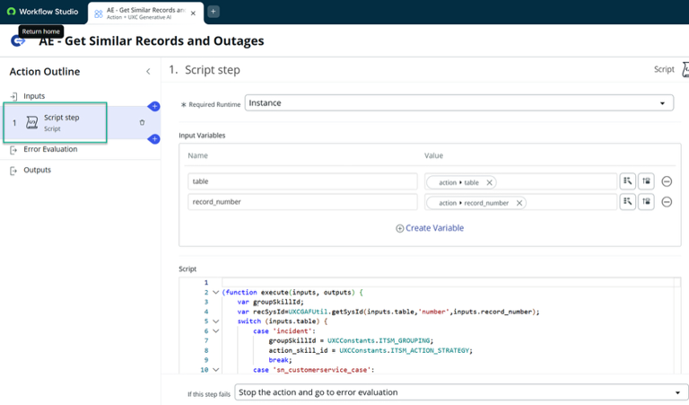"

18. Replace the script with the script below.

```javascript
(function execute(inputs, outputs) {
    var groupSkillId;
    var action_skill_id;
    var recSysId = UXCGAFUtil.getSysId(inputs.table, 'number', inputs.record_number);

    var tableMapping = {
        'incident': { group: UXCConstants.ITSM_GROUPING, action: UXCConstants.ITSM_ACTION_STRATEGY },
        'sn_customerservice_case': { group: UXCConstants.CSM_GROUPING, action: UXCConstants.CSM_ACTION_STRATEGY },
        'sn_hr_core_case': { group: UXCConstants.HR_GROUPING, action: UXCConstants.HR_ACTION_STRATEGY }
    };

    var config = tableMapping[inputs.table];
    if (config) {
        groupSkillId = config.group;
        action_skill_id = config.action;
    }

    var grpSysId = UXCGAFUtil.getGroupSysId(recSysId, inputs.table, inputs.record_number, groupSkillId);
    var recs = grpSysId ? UXCGAFUtil.getGAFSimilarRecs(grpSysId, groupSkillId) : UXCGAFUtil.getRecReferences(inputs.table, recSysId);

    outputs.references = JSON.stringify(recs);

    var sysIds = [];
    if (Array.isArray(recs)) {
        recs.forEach(function(item) {
            var id = item.sys_id || item.sys_Id;
            if (id) sysIds.push(id.toString());
        });
    }

    outputs.sys_ids = JSON.stringify(sysIds);

    if (sysIds.length === 0) {
        outputs.outage_details = "No related records found.";
        return;
    }

    var reportLines = [];
    var outageGR = new GlideRecord('cmdb_ci_outage');
    outageGR.addQuery('task_number', 'IN', sysIds);
    outageGR.orderBy('task_number');
    outageGR.query();

    var currentTask = "";
    while (outageGR.next()) {
        if (currentTask != outageGR.task_number.getDisplayValue()) {
            currentTask = outageGR.task_number.getDisplayValue();
            reportLines.push("\n--- Outages for Task: " + currentTask + " ---");
        }

        reportLines.push(" ----------------------------------------");
        reportLines.push(" Outage: " + outageGR.getDisplayValue());
        reportLines.push(" Begin: " + outageGR.begin.getDisplayValue());
        reportLines.push(" End: " + outageGR.end.getDisplayValue());
        reportLines.push(" Description: " + (outageGR.description || "No description"));
        reportLines.push(" ----------------------------------------");
    }

    outputs.outage_details = reportLines.length > 0 ? reportLines.join('\n') : "No outages found for these records.";
})(inputs, outputs);
```

## Configure Output Variables

19. In the **Output Variables** window, create the output variables listed below and delete any remaining variables.


20. On the left, click **Outputs**.

21. Click **Edit Outputs**.

22. Delete the **message** output and confirm the popup.

23. Change the **References** label to **similar records**.

24. Create a new output using the values below.

| Field | Value |
|---|---|
| Label | outage details |
| Name | outage_details |
| Type | String |

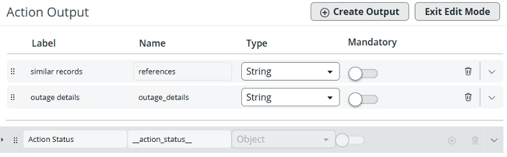"

25. Click **Exit Edit Mode**.

26. Drag and drop the script step variables from the right into the corresponding boxes in the middle.

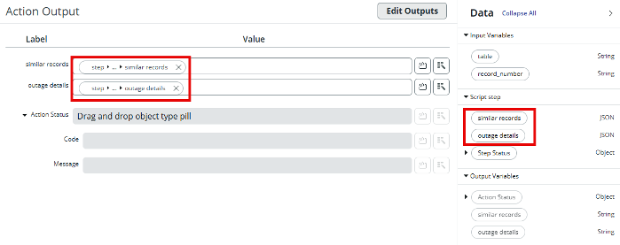"

## Test and Publish the Action

27. Click **Test**.

28. Configure the test values below.

| Field | Value |
|---|---|
| type | incident |
| record_number | INC0010248 |

29. Click **Run Test**.

30. When the test completes, click **Your test has finished running. View the Action execution details.**

"

31. Return to the previous window.

32. Click **Save**, then click **Publish**.

33. Close the Workflow Studio browser tab and return to the main lab browser tab.

34. Change the application scope back to **Global**.

"

## Copy the Create Outage Action

35. Open **Flow Designer**.

   Navigate to:

   `All > Flow Designer`

36. On the **Actions** tab, search for **outage**.

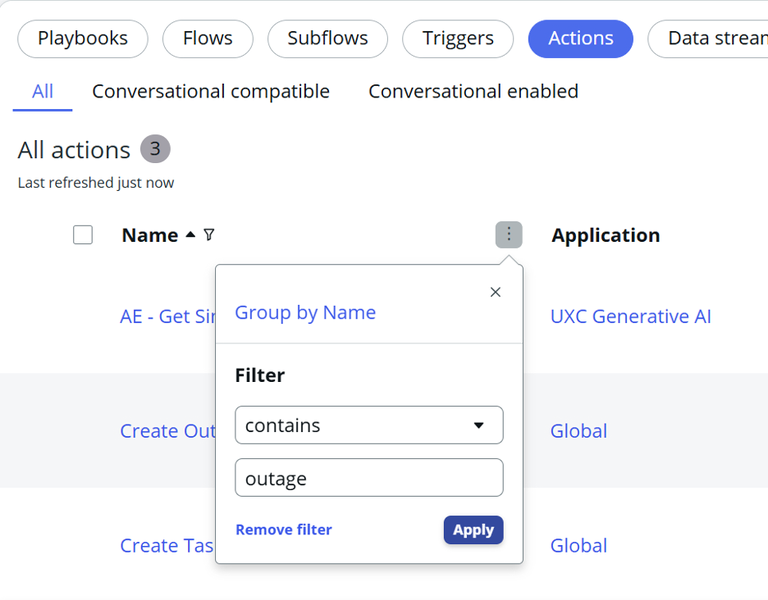"

37. Open **Create Outage**.

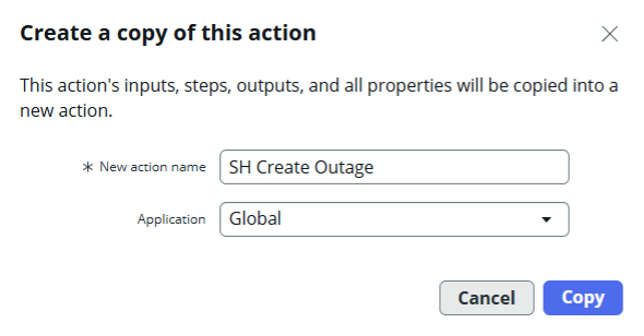"

38. Copy the action and name it:

```text
[Your Initials] Create outage
```

39. Delete the following inputs.

- configuration item
- type
- begin

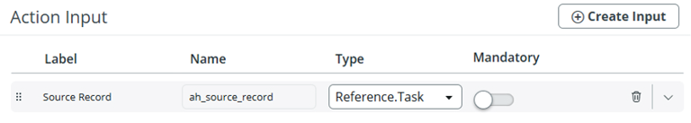"

40. On the left, click **Script Step**.

41. Delete the following variables.

- cmdbCI
- type
- begin

"

42. Replace the existing script with the script below.

```javascript
(function execute(inputs, outputs) {
    var parentTable = GlideDBObjectManager.get().getBase(inputs.source.getRecordClassName());
    var outage = new GlideRecord("cmdb_ci_outage");
    outage.initialize();

    outage.setValue("type", "Degradation");
    outage.setValue("short_description", "degradation");

    if (parentTable == "task")
        outage.setValue("task_number", inputs.source.getUniqueValue());

    outputs.OutageRecord = outage.insert();
    outputs.outagerecordnumber = outage.getValue("number");
})(inputs, outputs);
```

## Configure the Outage Action Output

43. Add an output variable using the values below.

| Field | Value |
|---|---|
| Label | OutageRecordNumber |
| Name | outagerecordnumber |
| Type | String |
| Mandatory | True |

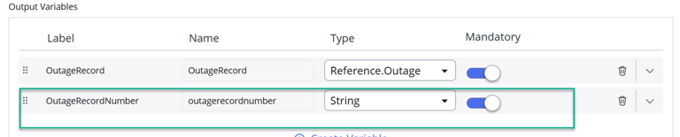"

44. On the left, click **Outputs**.

45. Click **Edit Outputs**.

46. Click **Create Output**.

47. Edit the new output using the values below.

| Field | Value |
|---|---|
| Label | Outage Number |
| Name | outage_number |
| Type | String |

"

48. Click **Exit Edit Mode**.

49. Drag the **OutageRecordNumber** script variable to the **Outage Number** action output box.

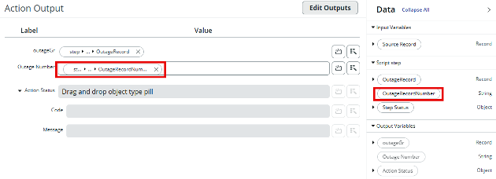"

## Test and Publish the Create Outage Action

50. Click **Test**.

51. Select **INC0000001** as the source record.

52. Click **Run Test**.

53. When the test completes, click **Your test has finished running. View the Action execution details.**

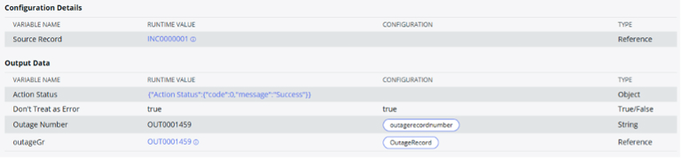"

54. Return to the previous window.

55. Click **Save**, then click **Publish**.

56. Close the Workflow Studio browser tab and return to the main lab browser tab.

## Section 2.4.2 - Extra: Build the AI Agent

Now open AI Agent Studio and build another AI Agent by duplicating **Incident Solution Recommender**.

1. Open **AI Agent Studio**.

   Navigate to:

   `All > AI Agent Studio > Overview`

2. Click **Create and Manage**.

3. Select the **AI Agent** tab.

4. Select **Incident Solution Recommender**.

5. Use the top-right form button to duplicate the agent.

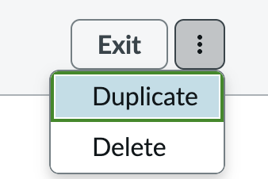"

6. Click **Duplicate** when prompted.

7. Update the agent fields using the values below.

| Field | Value |
|---|---|
| Name | Incident Solution Recommender with Outage Check |

8. Use the following instructions.

```text
1. Get the details of the incident.
2. Get similar incident records using the incident table.
3. Search the Knowledge Base using the incident short description.
4. Review the incident details, similar incidents, knowledge articles, and any outage information.
5. Generate recommendations for resolving the incident.
6. Add an Additional Comment to the incident that:
   - Includes recommended resolution steps.
   - References relevant similar incidents.
   - References relevant knowledge articles.
   - References outage information when applicable.
   - Clearly states that the comment was generated by an AI Agent.
7. Present findings to the user using the following format:
## Incident Summary
- Incident Number
- Short Description
- State
- Priority
- Assigned To
## Recommended Resolution Steps
- List the recommended actions in priority order.
## Relevant Similar Incidents
- Incident Number
- Brief description
- Brief resolution summary
## Relevant Knowledge Articles
- Article Number
- Article Title
- One-sentence explanation of relevance
## Outage Information
- Summarize any outage patterns found.
- Omit this section if no outages exist.
8. Never:
   - Return raw JSON.
   - Return sys_ids.
   - Return similarity scores.
   - Return embeddings.
   - Return internal record payloads.
   - Return full knowledge article text.
   - Return technical metadata.
9. If outages are found in similar incidents, ask whether the user would like an outage created for the current incident.
10. If an outage is successfully created, add the outage number to the Additional Comments field and notify the user.
11. End.
```

9. Click **Save and continue**.

## Update the Similar Incident Tool

10. Open the existing **Get Similar Incident Records** flow action.

11. Select the flow action:

```text
[Your Initials] Get Similar Records and Outages
```

12. Change the name to:

```text
[Your Initials] Get Similar Incident Records and Outages
```

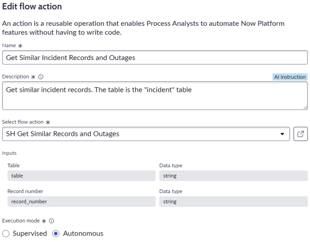"

13. Click **Save**.

## Add the Create Outage Tool

14. Click the **Add tool** dropdown.

15. Select **Flow action**.

16. Configure the tool using the values below.

| Field | Value |
|---|---|
| Name | Create Outage |
| Description | Create an outage for the task or record being resolved. |
| Flow action | [Your initials] Create Outage |
| Execution mode | Autonomous |
| Display output | Yes |
| Output transformation strategy | Concise |

17. Click **Add**.

18. Confirm the tools look correct.

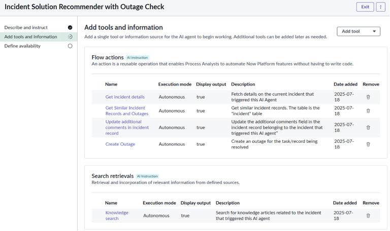"

19. Click **Save and Continue**.

20. On **Define Availability** (or Activation status), set **Status** to **On**.

21. Click **Save and Test**.

## Test the Agent

1. In the **Task** box, enter:

```text
INC0010004
```

2. Click **Start test**.

3. At the end of the test, check the comments in **INC0010004**.

"

## Completion

Congratulations. You have completed the advanced part of the lab.
