# Section 2.1 Build a Simple Agent | World Forums and Summits Learning Labs 2026

For the complete documentation index, see [llms.txt](https://servicenow-events-or-lab-guidebo.gitbook.io/world-forums-learning-labs-2026/llms.txt). This page is also available as [Markdown](section-2.4-optional-build-an-ai-agent-that-checks-outages-in-similar-incidents.md).

First, let’s create an outage in incident INC0010248.

1. Open the incidents table (**All > Incident > All)**
2. Search for I**NC0010248** and open it
3. Scroll down to the bottom of the page, and select the **Outages tab.** If the tab is not visible, ask your instructor how you can add it as a related list.
4. Click **New**

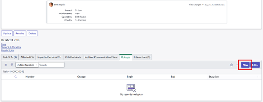

1. In the **Outage New record page**, select **Degradation** from the Type list, and fill in the T**ask number** field with the incident number **“INC0010248**”:

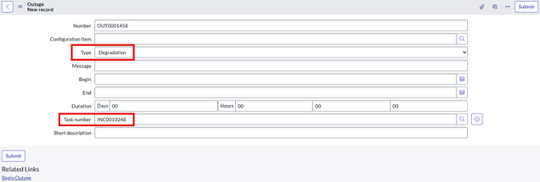

1. Click **Submit**
2. Click the **Update** button to return to the incidents list

Now, we need to switch scope to “**Platform AI Agents and Skills**”.

1. Click the Application Scope icon at the top of the page

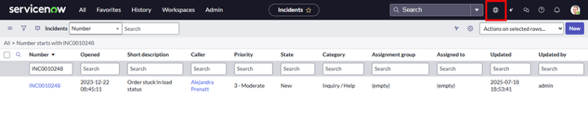

1. Select **Application scope**: Global, and then filter for and select **Platform AI Agents and Skills.**

NOTE: If you can’t find the scope “Platform AI Agents and Skills”. Please click to check **Appendix Section A4: Application Scope at the end of the document.**

Now let’s go to **Flow Designer** and modify the existing “Get Similar records” action and have it return outages found in similar incidents as well.

1. Open Flow Designer (**All > Flow Designer**) - this will open Flow Designer in a new tab
2. Under the Actions tab, find “**Get Similar Records**” and open it. **DO NOT OPEN “Get Similar Incident Records”**

1. Copy the action by clicking on the three dots (...) in the top right of the page

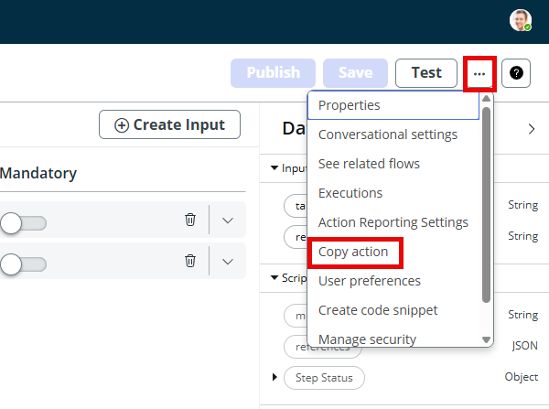

1. Change the action name to “**\[Your initials] Get Similar Records and Outages”** and be sure that **“Platform AI Agents and Skills”** is the Application selected.

1. Click **Copy**
2. On the left, click S**cript Step**

1. Please use the script text box below to copy/paste
2. In the Output Variables window (below the Script window), delete both existing variables, and create the following:

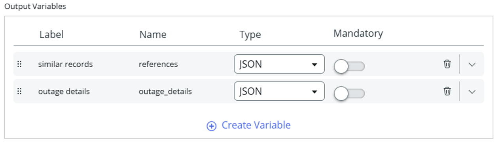

1. On the left, click **Outputs**, then click **Edit Outputs**
2. Delete the message output (confirm the popup window)
3. Change the label from “References” to “similar records”
4. Click Create Output with the label “outage details”, the name “outage\_details”, and the type String

1. Click on **Exit Edit Mode**
2. Drag and drop the script step variables from the right into their corresponding boxes in the middle, like this:

1. Click **Test**
2. Type “incident” into the type field, and “**INC0010248**” into the record\_number field, then click **Run Test**
3. When it appears, click “Your test has finished running. View the Action execution details.”

Your results should look like:

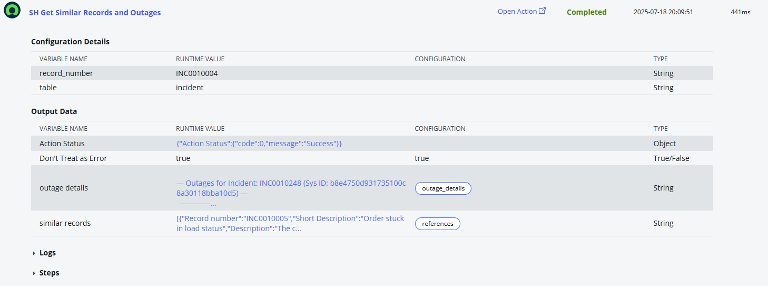

1. Return to the previous window, and click Save, then Publish
2. Close the Workflow Studio browser tab, and return to the main lab browser tab
3. Let’s change the Application Scope back to Global

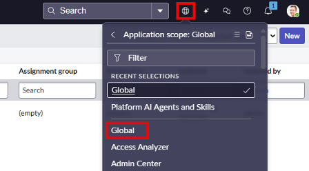

Now let’s create another Flow Action for creating an outage.

1. Open Flow Designer (All > Flow Designer) and search for “outage” under the Actions tab.

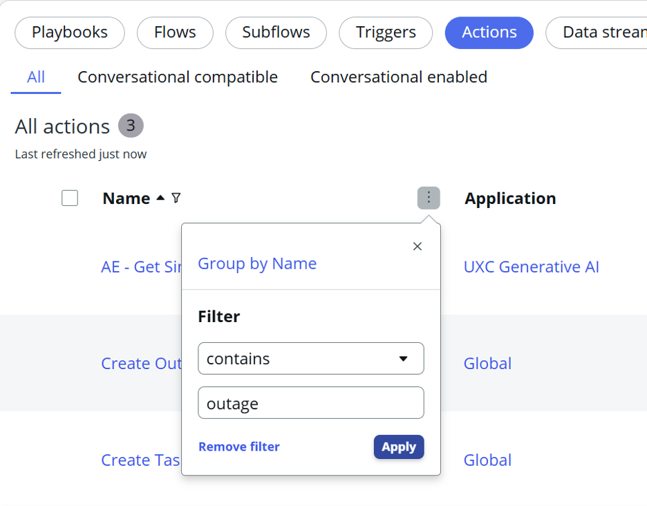

31. Click on Create Outage and copy the action, name it “\[Your Initials] Create outage.”

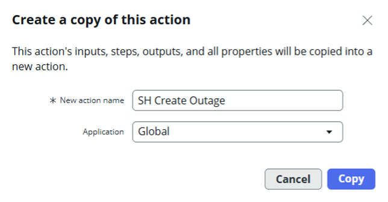

1. Delete the following inputs:
   1. “configuration item”
   2. “type”
   3. “begin”

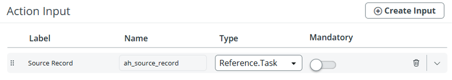

1. On the left, click **Script Step** and delete the following variables:
   1. “cmdbCI”
   2. “type”
   3. “begin”

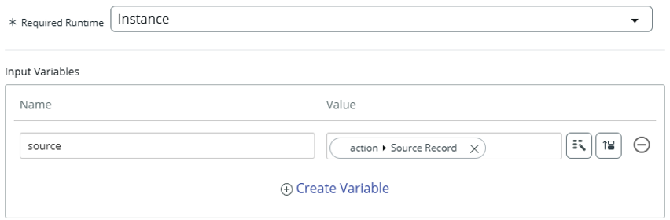

34. Replace the existing script with this one:
35. Then add an output variable with the following values:
    1. Label: “OutageRecordNumber”
    2. Name: outagerecordnumber
    3. Type: String
    4. Mandatory: True

1. On the left, click Outputs, then Edit Outputs, then Create Output
2. Edit the new Output with the following values:
   1. Label: “Outage Number”
   2. Name: “outage\_number”
   3. Type: String

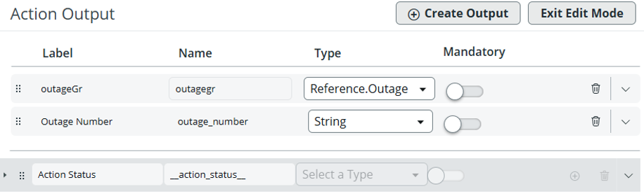

1. Click Exit Edit Mode
2. Drag the “OutageRecordNumber” Script variable to the Outage Number Action Output box.

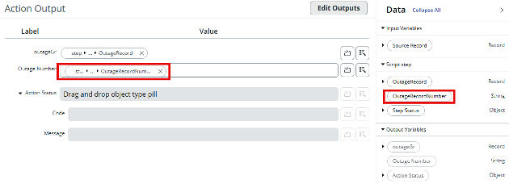

1. Click Test
2. Select “INC0000001” as the Source Record, and click Run Test
3. When it appears, click “Your test has finished running. View the Action execution details.”

Your results should look like:

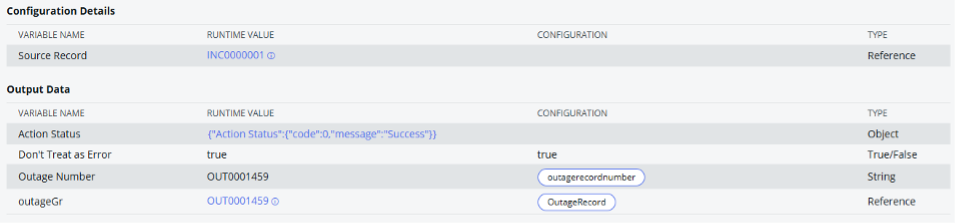

1. Return to the previous window, and click Save, then Publish
2. Close the Workflow Studio browser tab, and return to the main lab browser tab

**Section 2.4.2 - Extra - Build the AI Agent**

Now, let's open AI Agent Studio and build another AI agent. This time, we will duplicate the previously created AI agent “Incident Solution Recommender”.

1. Open AI Agent Studio (All > AI Agent Studio > Overview)
2. Click the Create and Manage module
3.  Click on the AI Agent tab, then select the "Incident Solution Recommender” and on the form, use the button at the top right to duplicate the agent

    
4. Click Duplicate when prompted
5. Update the fields with the following values:
   1. Name: “Incident Solution Recommender with Outage Check”
   2. Instructions (include the numbering):
6. Click Save and continue
7. Click on the existing “Get Similar Incident Records” flow action and change the name to “Get Similar Incident Records and Outages”
8. Select “\[Your Initials] Get Similar Records and Outages” as the flow action.

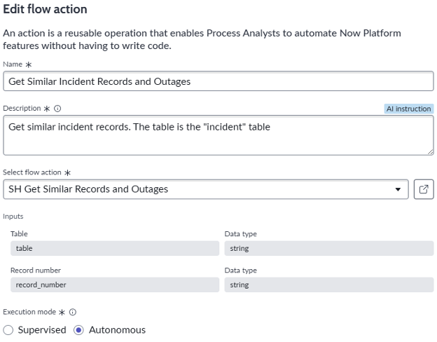

1. Click **Save**
2. Click the Add tool dropdown list, and select Flow action, then complete the fields with the following information:
   1. Name: “Create Outage”
   2. Description: “Create an outage for the task/record being resolved”
   3. Flow action: \[Your initials] Create Outage
   4. Execution mode: Autonomous
   5. Display output: Yes
   6. Output Transformation strategy: Concise.
3. Click Add-Your tools should look like this:

12. Click **Save and Continue**
13. On the Define Availability page, make sure the Status toggle is set to On
14. Click **Save and Test**

**Now let’s test the agent!**

· In the Task box enter “INC0010004” and click Start test.

· At the end of the test, check the comments in INC0010004:

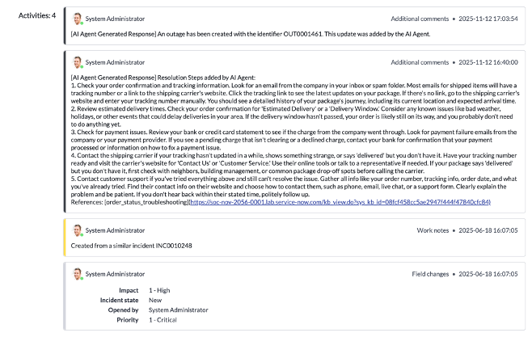

Congratulations! You have completed the advanced part of the lab!

1. In the Output Variables window (below the Script window), delete both existing variables, and create the following:

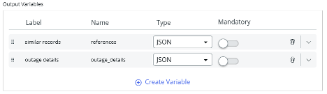

1. On the left, click **Outputs,** then click **Edit Outputs**
2. Delete the message output (confirm the pop-up window)
3. Change the label from “References” to “similar records.”
4. Click Create Output with the label “outage details”, the name “outage\_details”, and the type String.

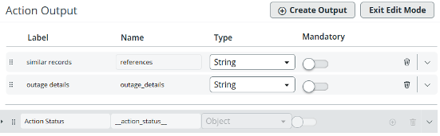

1. Click on **Exit Edit Mode**
2. Drag and drop the script step variables from the right into their corresponding boxes in the middle, like this:

1. Click **Test**
2. Type “incident” into the type field, and “INC0010004” into the record\_number field, then click **Run Test**

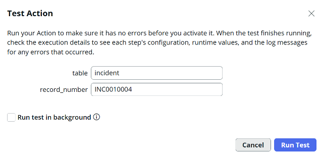

1. When it appears, click “Your test has finished running. View the Action execution details.” Results should look like this.

1. Return to the previous window, and click **Save, then Publish**
2. Close the Workflow Studio browser tab, and return to the main lab browser tab
3. Let’s change the Application Scope back to Global

Now let's create another Flow Action for creating an outage.

1. Open Flow Designer (**All > Flow Designer**) and search for “outage” under the Actions tab.

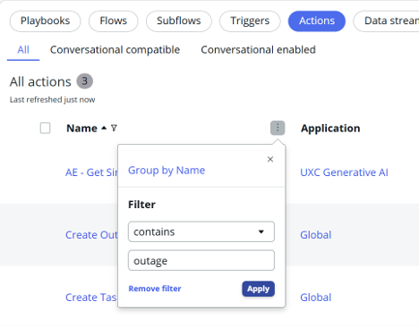

1. Click on **Create Outage** and copy the action, name it “\[Your Initials] Create outage”

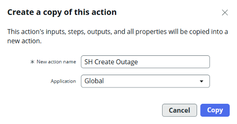

1. Delete the following inputs:
   1. “configuration item"
   2. “type”
   3. “begin”

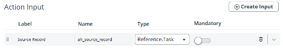

1. On the left, click **Script Step** and delete the following variables:
   1. "cmdbCI"
   2. “type”
   3. “begin”

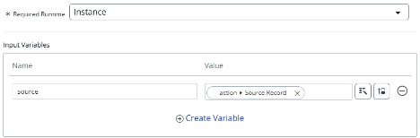

1. Replace script with this one:

[PreviousSection 2.3 Wrap your Agent in an agentic workflow](section-2.md)[NextSection 3. Now Assist for the Agent Persona](../section-3.md)

Last updated 3 months ago
