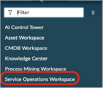
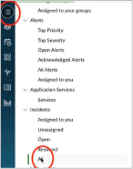
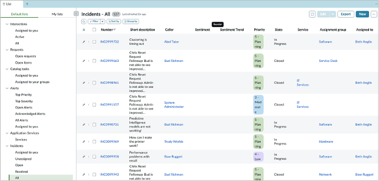
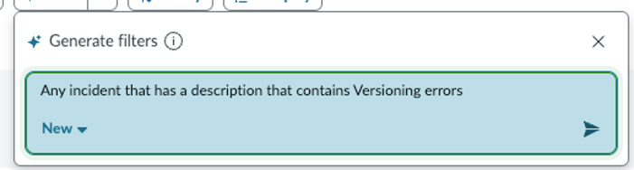
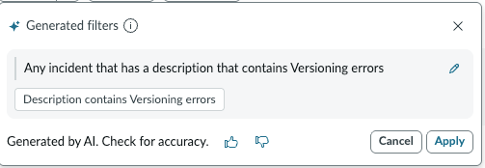
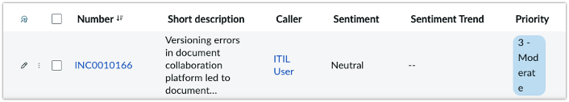
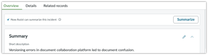
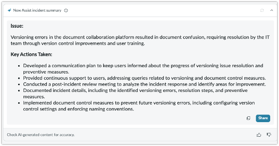
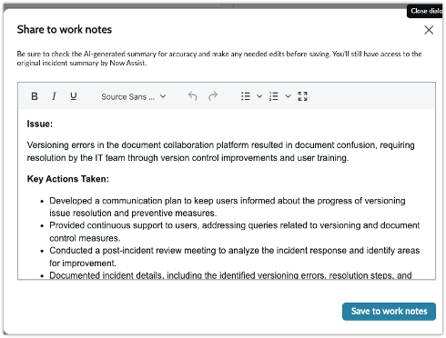

# Section 3.1 - Incident Summarization

In this exercise, you will use Now Assist to summarize an incident and post the generated summary to the work notes.

## Open Service Operations Workspace

1. Return to your lab instance by clicking the **ServiceNow** logo in the upper-left corner.

   Alternatively, remove any portal suffix from your instance URL.


2. Select the **Workspace** tab, then select **Service Operations Workspace**.

   Service Operations Workspace provides a consolidated view to help agents manage the life cycle of task records, such as incidents, requests, and walk-ups.



## Find the Incident

3. In Service Operations Workspace, select **List view** and under **Incidents**, select **All** to display the incident list.



4. In the incident list, select the **Filter** button with the GenAI sparkle icon in the upper-left area.



5. Select and copy the following query and watch Now Assist create the filter for you.

```text
Any incident that has a description that contains Versioning errors
```



6. Select **Apply** to process the query.



9. Select the incident link.

   Your incident number may be different from the one shown. Open the incident in Service Operations Workspace by clicking the incident number.



## Generate the Incident Summary

10. Select **Summarize** to use generative AI to summarize the incident.



11. Review the generated summary.

    The summarization skill analyzes the short description, description, work notes, and related records before generating the issue, SLAs, impacted services, and actions taken up to that point.




Your incident summarization may look slightly different from the screenshot shown.


12. Notice the icons at the bottom of the generated response.

| Icon or action | Purpose |
|---|---|
| Thumbs up or thumbs down | Send feedback during Now LLM retraining if the customer has opted into data sharing. |
| Copy | Copy the generated summary to the clipboard. |
| Regenerate | Generate a new version of the summary. |

13. Add the generated summary to the work notes by selecting **Share**.



14. Edit the summary by adding a bulleted item.

15. Select **Save to work notes**.


If the customer has opted into data sharing, edits to the generated response are also sent to the Now LLM for fine-tuning.


16. Expand the work note activity stream to confirm that your edits were copied.



**Bonus**

Return to the incident list and try the summarization skill with any in-progress incident. Try it a few times.


## Completion

Congratulations. You created an incident summary and posted it to the work notes.

Do not close Service Operations Workspace or the incident tab. You will use them in the next section.
