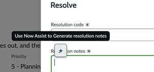
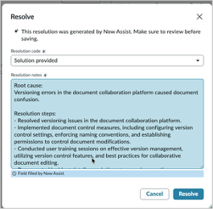

# Section 3.2 - Resolution Note Generation

In this exercise, you will use Now Assist to generate resolution notes and resolve the incident from Section 3.1.

## Generate Resolution Notes

1. In Service Operations Workspace, return to the incident from Section 3.1 with the short description that begins with **Versioning**.

2. In the upper-right corner of the incident, locate **Resolve**.

3. Click **Resolve** to open the resolution experience.

   

   Now Assist reviews the work notes for the current ticket and generates a potential resolution.

4. In the **Resolve** pop-up window, select the following resolution code.

         | Field | Value |
         |---|---|
         | Resolution code | Solution provided |

5. In the resolution notes box, click the **Now Assist** icon to generate resolution notes.

6. Click **Resolve** to save the resolution to the ticket.

   

   

## Review the Resolved Incident

7. Select the **Details** tab of the incident.

8. Confirm that the generated resolution was copied to the **Resolution notes** field.

9. Confirm that the incident state changed from **New** to **Resolved**.


**Bonus**

Return to the incident list and try to resolve any in-progress incident. Can you find another way to generate resolution notes? Hint: look for the sparkles.


## Completion

Congratulations. You generated resolution notes and resolved an incident.

Do not close your browser or incident tab. You will use them in the next section.
