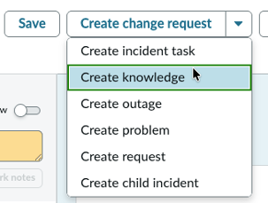
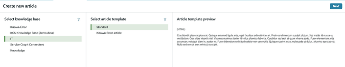
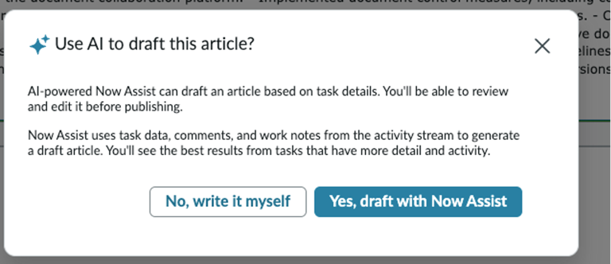
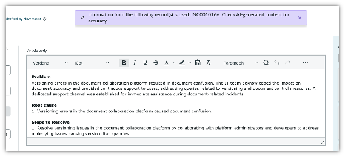

# Section 3.3 - Knowledge Creation

In this exercise, you will create a knowledge article from the same resolved incident.

## Create a Knowledge Article

1. On the same incident with the short description that begins with **Versioning**, locate the drop-down menu in the upper-right corner of the incident.

2. Click **Create Knowledge**.

   


**Tip**

In this lab, the Generate Knowledge skill is only available when the incident is in a **Resolved** or **Closed** state. Availability filters can be updated to fit your processes.


3. On the **Create New Article** template, configure the following values.

   | Field | Value |
   |---|---|
   | Select Knowledge Base | IT |
   | Select Article Template | Standard |

4. Click **Next**.

   

5. When the AI draft article pop-up appears, click **Yes, draft with Now Assist**.

   

6. Review the article body.

7. Compare the generated article to the details in the incident.

   

## Completion

Congratulations. You created a knowledge article.

Do not close your browser or the workspace. You will continue using them in the next section.
