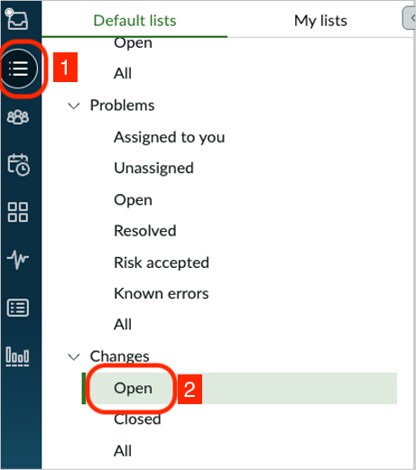
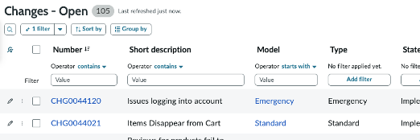
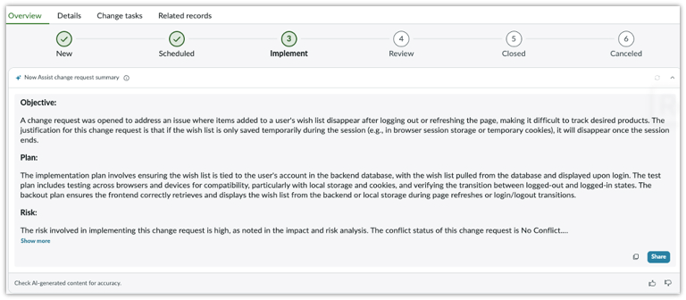

# Section 3.4 - Change Summarization

In this exercise, you will use Now Assist to summarize a change request.

## Open a Change Request

1. Select **List view**.

2. Scroll down to **Changes**.

3. Select **Open** to display a list of all open change records.

   

4. From the list of open **Changes**, locate and select **CHG0000080**.

   

## Generate the Change Summary

5. On the **Overview** tab, select **Summarize**.

6. Review the generated summary of the change request.

   

## Completion

Congratulations. You generated your first change summarization.

Do not close your browser or the workspace. You will continue using them in the next section.
