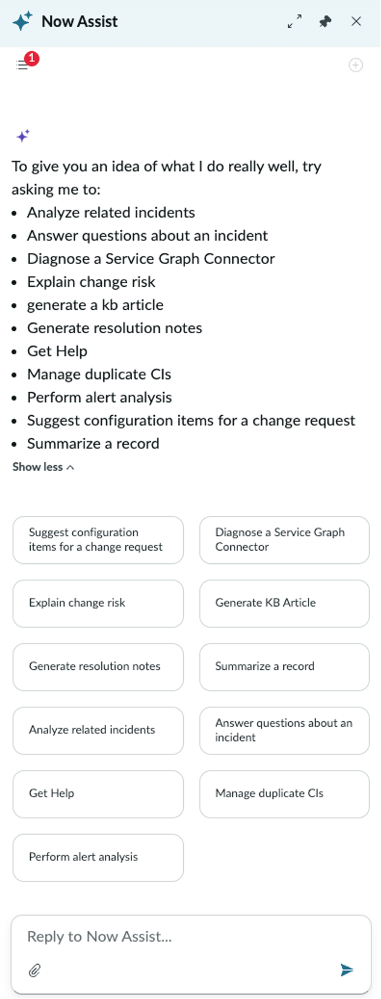
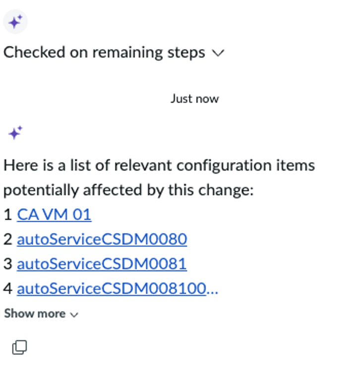

# Section 3.5 - Call the CI for Change Request Agent

In this exercise, you will use an AI Agent to suggest configuration items that may be impacted by a change request.

## Open the Now Assist Panel

1. From the same change request, click the Now Assist panel sparkle in the upper-right corner.

   

2. Review the available skills and agents this user has permission to use.

   

## Run the CI Recommendation Agent

3. Click the **Suggest Configuration Items for a change request** card.

   

4. Review the suggested configuration items.

   This agent searches the CMDB for CIs that may be impacted by the change. You can select one or more CIs to associate with the change.

## Completion

Congratulations. You summarized a change request, identified CIs impacted by a change request, and completed Now Assist for the Agent persona.
