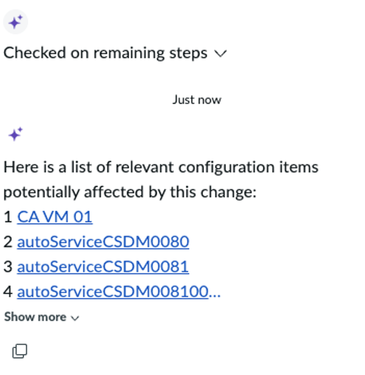

# Section 3.5 Call 'CI for Change request' agent | World Forums and Summits Learning Labs 2026

For the complete documentation index, see [llms.txt](https://servicenow-events-or-lab-guidebo.gitbook.io/world-forums-learning-labs-2026/llms.txt). This page is also available as [Markdown](section-3.5-call-ci-for-change-request-agent.md).

1. From the same change request, click on the Now Assist panel sparkle in the top right-hand corner

1. This will expand all the Skills and Agents that this user has permission to use.

1. Click on the Suggest "**Configuration Items for a change request**” card.

1. This agent searches the CMDB for CIs that may be impacted by this change.

You could select any of the Cis (or multiple) to associate with the change

**Congratulations!** You have summarized and identified Cis impacted by a change request and completed Now Assist for the Agent persona.

[PreviousSection 3.4 Change Summarization](section-3.md)[NextSection 4. Now Assist for the Employee Persona](../section-4.md)

Last updated 5 months ago
