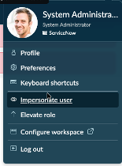
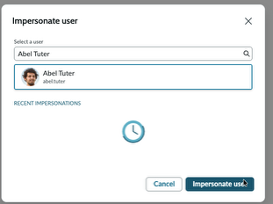
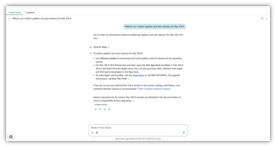

# Section 4.1 - Superpowered Search

In this exercise, you will impersonate an employee and use Now Assist for AI Search in Employee Center.

## Impersonate the Employee User

1. Select the profile picture in the upper-right corner.

2. Impersonate the following user:

   ```text
   Abel Tuter
   ```

   The window reloads after you impersonate the user.

   

   

## Open Employee Center

3. Open Employee Center.

   Navigate to:

   `All > Self-Service > Employee Center`

   Alternatively, append the following to the end of the instance URL in your browser address bar:

   ```text
   /esc
   ```

   

## Search with Now Assist

4. In the search box, enter the following question.

   ```text
   Where can I obtain updates and new releases for Mac OS X
   ```

5. Press **Enter**.

6. Review the full-screen enhanced search view.

   Now Assist uses AI Search to retrieve the top-ranked knowledge article, then sends the article content to the Now LLM to generate an answer to the original question. This helps employees get a concise answer without reading the entire knowledge article.

   

7. Notice the thumbs-up and thumbs-down buttons.

   If the customer has not opted out of data sharing, this feedback is sent to the Now LLM.


**Dive deeper**

ServiceNow uses a retrieval augmented generation architecture that places a semantic search engine before an LLM. To learn more, review [Under the Hood: Now Assist in AI Search](https://www.servicenow.com/community/now-assist-articles/under-the-hood-now-assist-in-ai-search/ta-p/2642915).


## Completion

Congratulations. You have finished reviewing Now Assist for AI Search.

Next, continue in the same enhanced chat view and pivot into a Now Assist for Virtual Agent conversation.