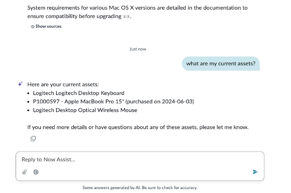
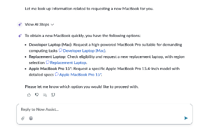
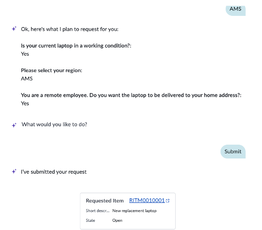

# Section 4.2 - Now Assist for the Virtual Agent

Before testing Now Assist for Virtual Agent, start with the key context: traditional chatbots, including ServiceNow Virtual Agent, require some development. Virtual Agent provides out-of-the-box conversations to reduce development effort, but customers often still need to modify conversations for their unique needs.

Generative AI changes that experience. If a user's request can be answered by a knowledge article or catalog item, Now Assist for Virtual Agent can dynamically generate the conversation without requiring new conversation development.

## Start a Virtual Agent Conversation

1. In the same enhanced screen, ask a new question.

   


**Tip**

If you cannot see the Virtual Agent icon, you are probably not in Employee Center. Confirm that you are using the correct URL.


2. Copy and paste the following question into the Now Assist window.

   ```text
   What are my current assets?
   ```

3. Press **Enter**.

   

## Request a Replacement Laptop

4. Copy and paste the following request.

   ```text
   I need a new macbook ASAP, I have a critical meeting in 2 days
   ```

5. Press **Enter**.

   

   

6. Notice how Now Assist switches tracks and follows the change in conversation.

7. Hover over the **Replacement laptop** option and click **Start Request**.

8. Respond to the questions as needed.

   

## Ask a VPN Question

9. Copy and paste the following question.

   ```text
   How do I connect to VPN?
   ```

10. Press **Enter**.

    

11. Review the generated response.

    Because the admin user's assets are recorded in ServiceNow, Now Assist knows that Abel has a Mac and provides the appropriate instructions.

## Completion

Congratulations. You tested search, engaged in a multi-turn conversation with Now Assist, and ordered a replacement laptop.

