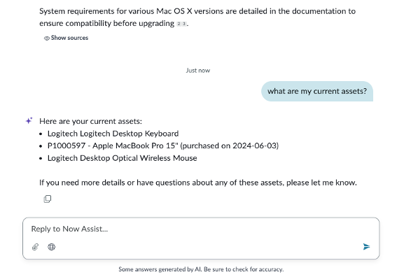
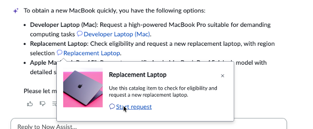
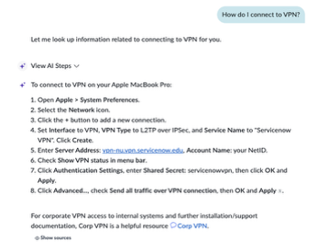

# Section 4.2 Now Assist for the Virtual Agent | World Forums and Summits Learning Labs 2026

For the complete documentation index, see [llms.txt](https://servicenow-events-or-lab-guidebo.gitbook.io/world-forums-learning-labs-2026/llms.txt). This page is also available as [Markdown](section-4.2-now-assist-for-the-virtual-agent.md).

Before we test out Now Assist for Virtual Agent, let's pause for a quick history lesson:

All chatbots – including ServiceNow's Virtual Agent (VA) – require some development. VA provides out-of-the-box conversations to reduce development, but customers must still use developers to modify them to suit their unique needs.

Generative AI changed all that. If a user's request could be answered by a knowledge article or a catalog item (in many cases, up to 70% of incidents/cases fall into this category), then Now Assist in VA would dynamically generate the conversation – NO DEVELOPMENT needed. This is huge, and you're about to see why.

1. In the same enhanced screen, let’s ask a new question

Tip: If you can’t see the VA icon, you’re probably not in the Employee Center. Double-check that you’re using the correct URL!

1. **Copy and paste** the following into the Now Assist window and **hit enter**

> What are my current assets?

1. Now, **copy and paste** the following and **hit enter**:

> I a need a new macbook ASAP, I have a critical meeting in 2 days

Note how Now Assist switches tracks and follows the change in conversation. Hover over the Replacement laptop option and c**lick Start Request**, then respond to the questions as needed.

1. Next, **copy and paste** the following and **hit enter**

> How do I connect to VPN?

Because the Admin's assets are recorded in ServiceNow, Now Assist knows that Abel has a Mac and provides the appropriate instructions. Also, easily pivoting from question to question.

**Congratulations,** you have tested search, engaged in a multi-turn conversation with Now Assist, and even ordered a replacement laptop. You have completed this section!

[PreviousSection 4.1 Superpowered Search](section-4.md)[NextSection 5. Now Assist for the IT Ops Agent](../section-5.md)

Last updated 5 months ago
