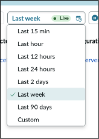
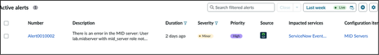

# Section 5.1 - Alert Express List

In this exercise, you will act as an operator and review alerts in the Express List within Service Operations Workspace.

The operator reviews alerts to identify issues, assess impact, and determine how to resolve them. This lab focuses on how Now Assist can help analyze alerts. It does not cover every action an operator might take in AIOps.

## Open the Express List

1. Close any popups that appear when you first log in.

2. Open **Express List** from the left navigation bar.

   Express List is the second icon from the bottom.

   

3. Close the pop-up window that appears.

4. In the upper-right corner of the Express List, click the dropdown labeled **Last week**.

   This displays all alerts received by the system.

   

5. Confirm that the Express List shows more alerts and some alert groups.

   

## Quick Sidebar: What Are Alerts?

Events are raw payloads from monitoring tools. Many events are noise, meaning they include information an operator would not act on. These may be informational events, events that have not met a specific threshold, or events that have not occurred enough times to be concerning.

Alerts are events important enough for an operator to investigate and act on. The Express List shows alerts to the operator.

Alert groups contain related alerts. For example, if a web server times out because its host system is out of memory or compute resources, alerts may appear for both the web server transaction failures and the host system resource issue.

In the Express List, alert groups are identified by a circled number next to the alert number. To view other alerts within the group, click the arrow on the left side of the primary alert number.

## Transition

Next, focus on alert analysis and how Now Assist transforms machine-generated output into natural language.
