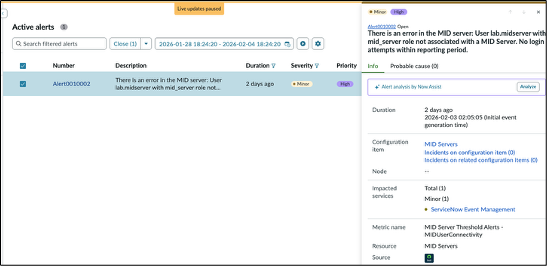

# Section 5.2 - Alert Analysis

Now Assist for ITOM can analyze a group of alerts and consider multiple factors. This can reduce the time an operator spends reviewing each alert and understanding how alerts relate to each other.

In this exercise, you will use Now Assist for ITOM as an operator to analyze an alert group.

## Analyze an Alert Group

1. Find the alert with the following number.

   ```text
   Alert0010002
   ```

2. Click anywhere in the alert's **Description**.

   The details panel opens.

   

3. Click **Analyze**.

   It may take a few moments for Now Assist for ITOM to analyze the alert group.

   

4. Review the returned analysis for the alert group.

   Read through the generated response to see how Now Assist for ITOM helps an operator understand what happened and identify what to investigate.

   

## Completion

Congratulations. You completed the Now Assist for ITOM portion of the lab.
