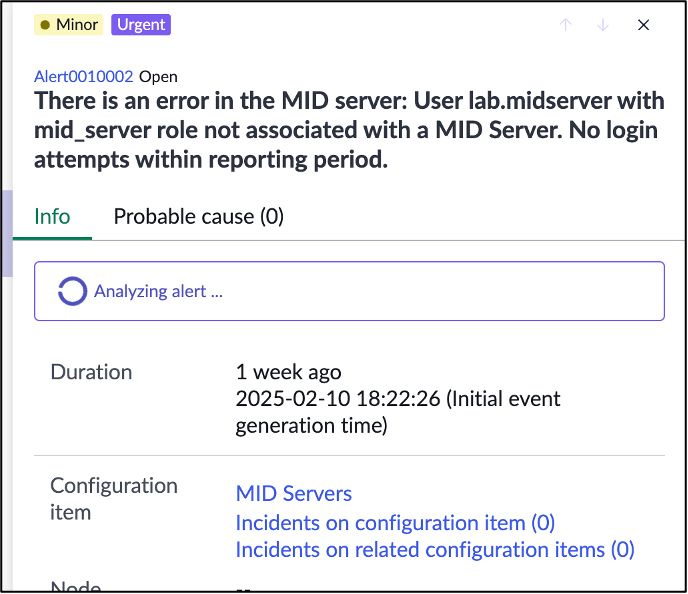

# Section 5.2 Alert Analyzation | World Forums and Summits Learning Labs 2026

For the complete documentation index, see [llms.txt](https://servicenow-events-or-lab-guidebo.gitbook.io/world-forums-learning-labs-2026/llms.txt). This page is also available as [Markdown](section-5.2-alert-analyzation.md).

Now Assist for ITOM can analyze a group of alerts and consider multiple factors, leading to an analysis that can significantly reduce the time an operator needs to spend reviewing each alert in the group and understanding what happened and how it relates to other alerts in the group.

In this part of the lab, you will use Now Assist for ITOM as an operator to gain hands-on experience with what an operator would see when analyzing individual alerts and groups of alerts.

1. Find the alert with the number **Alert0010002**. **Click anywhere in the alert's Description**. It opens the details panel.

1. Click on the **Analyze button**. It may take a few moments to return, as Now Assist for ITOM is analyzing the group of alerts.

1. Once the result is returned, the analysis for the alert group is displayed. Read through it to see an example of the type of analysis Now Assist for ITOM will perform to help an operator quickly understand what happened and identify what to look for to fix the issue.

**Congratulations,** you have completed the Now Assist for ITOM portion of the lab!

[PreviousSection 5.1 Alert Express list](section-5.md)[NextSection 6. Now Assist for the Developer Persona](../section-6.md)

Last updated 5 months ago
