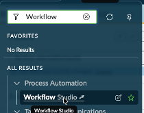
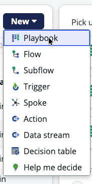
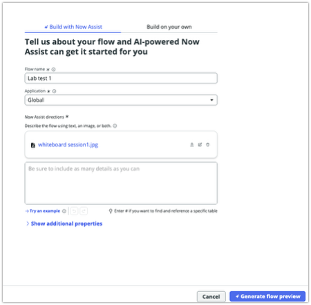
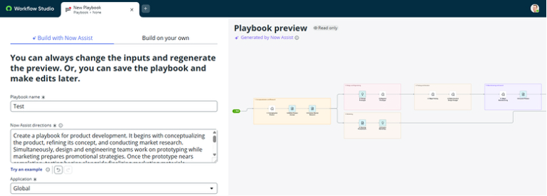

# Section 6.1 - Playbook Generation

Everyone in the room has probably drawn a brilliant flow on a whiteboard and then had to figure out how to get it into ServiceNow.

In this exercise, you will use Now Assist for Creator to generate a playbook from process details.

## Open Workflow Studio

1. Open **Workflow Studio**.

   Navigate to:

   `All > Process Automation > Workflow Studio`

   The ServiceNow platform uses workflows to orchestrate process steps and integrate them into systems. Flow Designer is used to build those workflows.

   

2. In the new Workflow Studio tab, click **New** on the far right.

3. From the dropdown menu, select **Playbook**.

   

## Generate the Playbook

4. Copy and paste the following text into the description field.

   ```text
   Step 1 - Concern Intake (Faculty, Staff, Students, and Student Care Team)
   - Submit a student concern through the Student Support portal.
   - Review the submitted concern and validate available information.
   - Create a Student of Concern case record.
   
   Step 2 - Initial Risk Assessment (Student Care Team)
   - Assess the reported behavior and available case details.
   - Determine whether the case presents Low, Medium, or High risk.
   - Escalate emergency situations to Campus Safety for immediate response.
   
   Step 3 - Parallel Case Review (Academic Advising, Residence Life, Counseling Services, Disability Services, and Student Affairs)
   - Academic Advising reviews academic performance, attendance trends, and faculty concerns.
   - Residence Life reviews housing incidents, resident assistant observations, and community concerns.
   - Counseling Services reviews previous support interactions and outreach opportunities.
   - Disability Services determines whether accommodations or support plans exist.
   - Student Affairs reviews conduct history and prior intervention records.
   
   Step 4 - Multidisciplinary Case Review (Student Affairs, Counseling Services, Academic Advising, Residence Life, and Campus Safety)
   - Review findings gathered from all participating departments.
   - Assess overall student risk and support needs.
   - Determine the appropriate intervention strategy and assign ownership.
   
   Step 5 - Intervention Planning and Execution (Assigned Support Teams)
   - Initiate counseling referrals and outreach activities when appropriate.
   - Create academic success plans and advisor follow-up activities when needed.
   - Launch conduct management activities when policy violations are identified.
   - Coordinate wellness checks and additional support services as required.
   - Execute multiple intervention activities concurrently based on the student's needs.
   
   Step 6 - Ongoing Monitoring (Student Care Team and Assigned Departments)
   - Monitor student progress and engagement with assigned services.
   - Collect status updates from participating departments on a recurring basis.
   - Track completion of intervention activities and follow-up tasks.
   - Escalate the case if new concerns or risk indicators emerge.
   
   Step 7 - Case Closure and Outcome Reporting (Student Affairs, Student Care Team, and Leadership)
   - Conduct a final review of interventions, outcomes, and recommendations.
   - Document services utilized, case resolution details, and follow-up guidance.
   - Close the Student of Concern case.
   - Generate leadership reports and trend analysis for continuous improvement.
   ```

   

   

5. Enter a flow name.

6. In **Attach an Image**, select the file you downloaded.

7. Click **Generate flow preview**.

8. Review the generated flow.

   Now Assist for Creator gives you a jumpstart on playbook development.

9. When you are finished, click **Discard playbook**.
