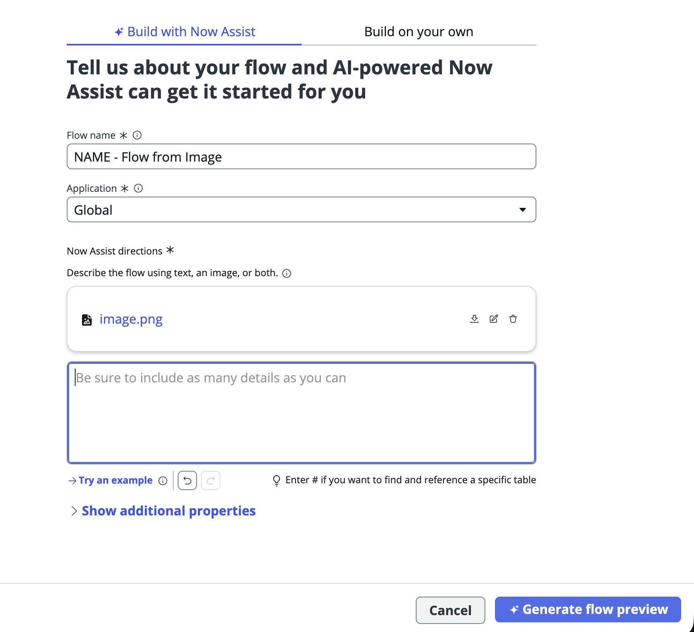

# section-6.2-flow-generation.md

## section-6.2-flow-generation.md

> For the complete documentation index, see [llms.txt](https://servicenow-events-or-lab-guidebo.gitbook.io/world-forums-learning-labs-2026/llms.txt). Markdown versions of documentation pages are available by appending `.md` to page URLs; this page is available as [Markdown](https://servicenow-events-or-lab-guidebo.gitbook.io/world-forums-learning-labs-2026/world-forums-and-summits-learning-labs/put-ai-to-work-shop-for-service-operations/section-6.-now-assist-for-the-developer-persona/section-6.2-flow-generation.md).

## Section 6.2 Flow Generation

Now let's create a flow with based on a prompt along with an image.

**Generate Flow from Text**

1. You should be back in the Workflow Studio tab. This time, select \*\*New > Flow.\*\*&#x20;


2. Copy and past this into the “Now Assist Directions give the flow a name, and hit Generate flow preview.

```
Brand new process in place for next week
Step 1 — Pre-Intake (GCR-Creative)
Review the upcoming GCR roadmap to identify expected creative needs.
• Create placeholder projects for resource and skill forecasting.
Step 2 - Project Intake (Requestors)
• Creative requests submitted via the Parent GCR intake system (Jira).
• Each Jira ticket generates a linked Jira Child ticket for GCR Creative's workflow.
Step 3 - Resource Review (Creative Leads)
• Weekly review of capacity and assign resources by skill, role, and availability.
Step 4 — Project Kick-Off (Creative Leads & Team Members)
• Finalize the creative brief, set milestones, confirm deliverables, and assign ownership.
Step 5 - Concept & Create (Creative Team Members)
• Execute tasks in alignment with the agreed timelines and quality standards.
Step 6 - Review & Delivery (Creative Leads)
• Review, approve, and deliver assets.
Step 7 - Reporting & Finance Tracking (Creative Leads, Managers & Finance/Operations)
• Capture time spent, cost, and resource utilization data.
Link spend to specific initiatives, reconcile with finance systems, and update stakeholder
```

3. Review the proposed flow. Does it follow the directions laid out by the Now Assist prompt?&#x20;


4. When you are finished, click \*\*Discard flow.\*\*&#x20;


**Generate Flow from Image**

1. First, download this image:&#x20;


2. You should be back in the Workflow Studio tab. This time, select \*\*New > Flow.\*\*&#x20;
3. Provide a name of your new flow and upload the image:&#x20;



4. Click \*\*Generate flow preview\*\* and let Now Assist create a flow from the image!


Note: If the generation fails the first time, please attempt it again.


5\. Review the Flow preview on the right hand side. Did Now Assist pick up the logic required from the image? !\[]\(/files/ElU4fJTdGzzuE5eGY8Kz)


5. Feel free to Discard flow, or Save and edit flow to review the AI-generated flow further.
6. Once complete, \*\*close the Workflow Studio tab.\*\*---

## Agent Instructions

This documentation is published with GitBook. GitBook is the documentation platform designed so that both humans and AI agents can read, navigate, and reason over technical content effectively. Learn more at gitbook.com.

### Querying This Documentation

If you need additional information that is not directly available in this page, you can query the documentation dynamically by asking a question. Perform an HTTP GET request on the current page URL with the `ask` query parameter, and the optional `goal` query parameter:

```
GET https://servicenow-events-or-lab-guidebo.gitbook.io/world-forums-learning-labs-2026/world-forums-and-summits-learning-labs/put-ai-to-work-shop-for-service-operations/section-6.-now-assist-for-the-developer-persona/section-6.2-flow-generation.md?ask=&goal=
```

`ask` is the immediate question: it should be specific, self-contained, and written in natural language. `goal` is optional and describes the broader end goal you are ultimately trying to accomplish on behalf of the user. GitBook uses it to tailor the answer towards what is most useful for that goal. The response will contain a direct answer to the question and relevant excerpts and sources from the documentation. Use this mechanism when the answer is not explicitly present in the current page, you need clarification or additional context, or you want to retrieve related documentation sections.
