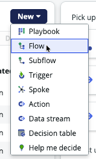
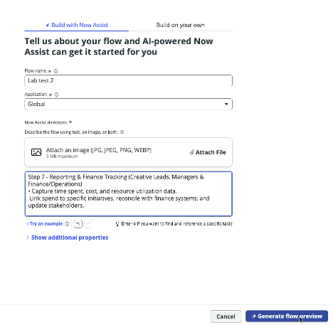
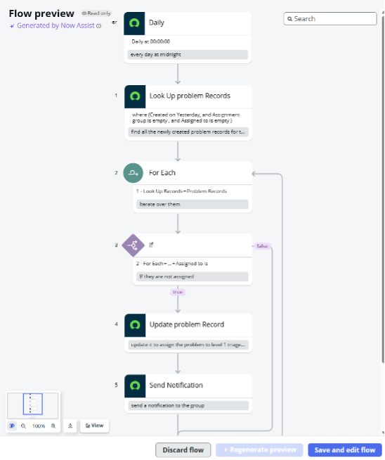
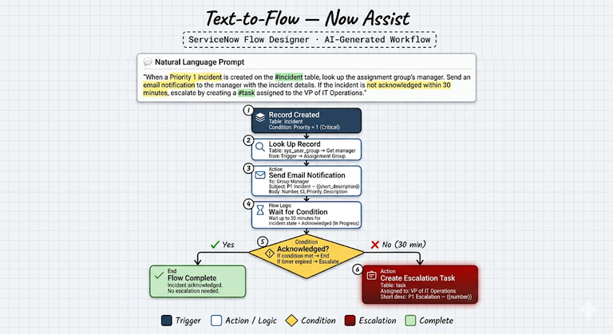
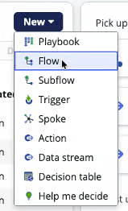
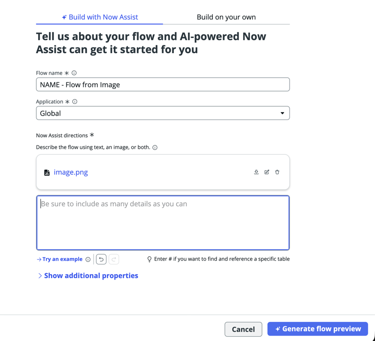
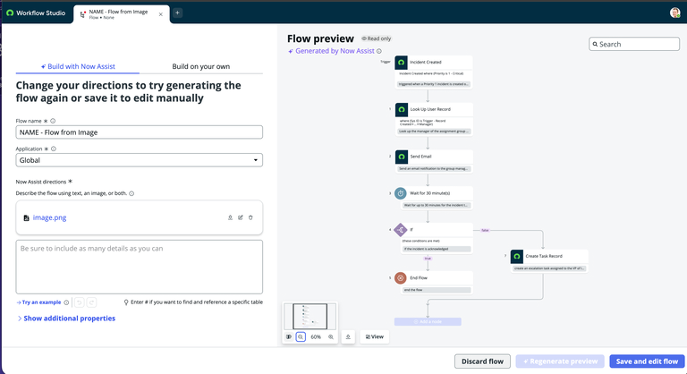

# Section 6.2 - Flow Generation

In this exercise, you will create flows from a text prompt and from an image.

## Generate a Flow from Text

1. Return to the Workflow Studio tab.

2. Select **New > Flow**.

   

   

3. Copy and paste the following text into **Now Assist Directions**.

   ```text
   Brand new process in place for next week

   Step 1 - Pre-Intake (GCR-Creative)
   - Review the upcoming GCR roadmap to identify expected creative needs.
   - Create placeholder projects for resource and skill forecasting.

   Step 2 - Project Intake (Requestors)
   - Creative requests submitted via the Parent GCR intake system (Jira).
   - Each Jira ticket generates a linked Jira Child ticket for GCR Creative's workflow.

   Step 3 - Resource Review (Creative Leads)
   - Weekly review of capacity and assign resources by skill, role, and availability.

   Step 4 - Project Kick-Off (Creative Leads and Team Members)
   - Finalize the creative brief, set milestones, confirm deliverables, and assign ownership.

   Step 5 - Concept and Create (Creative Team Members)
   - Execute tasks in alignment with the agreed timelines and quality standards.

   Step 6 - Review and Delivery (Creative Leads)
   - Review, approve, and deliver assets.

   Step 7 - Reporting and Finance Tracking (Creative Leads, Managers, and Finance/Operations)
   - Capture time spent, cost, and resource utilization data.
   - Link spend to specific initiatives, reconcile with finance systems, and update stakeholders.
   ```

4. Give the flow a name.

5. Click **Generate flow preview**.

6. Review the proposed flow.

   Does the generated flow follow the directions from the Now Assist prompt?

   

7. When you are finished, click **Discard flow**.

   

## Generate a Flow from an Image

8. Download the image shown below.

   

9. Return to the Workflow Studio tab.

10. Select **New > Flow**.

11. Provide a name for the new flow.

12. Upload the image.

    

13. Click **Generate flow preview**.


**Note**

If generation fails the first time, attempt it again.


14. Review the flow preview on the right side.

    Did Now Assist identify the required logic from the image?

    

15. Choose one of the following options:

- Click **Discard flow**.
- Click **Save and edit flow** to review the AI-generated flow further.

16. When complete, close the Workflow Studio tab.
