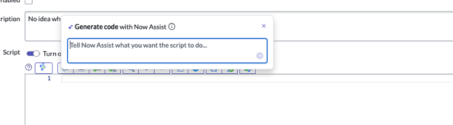

# Section 6.3 - Code Generation

In this exercise, you will use Now Assist to generate script logic in a Script Include.

## Create a Script Include

1. Go to **Script Includes**.

   Navigate to:

   `All > System Definition > Script Includes`

   A script include is a reusable server-side script that provides logic to define a function or class.

   

2. Select **New** in the upper-right corner.

3. Close any popups that appear.

4. Configure the Script Include using the values below.

   | Field | Value |
   |---|---|
   | Name | [Your initials] Test Script |
   | Description | My first test script |

5. Replace the default code with the following instruction.

   ```javascript
   //predict assignment group using predictive intelligence classification model
   ```

6. Generate code with the keyboard shortcut for your operating system.

   | Operating system | Shortcut |
   |---|---|
   | macOS | Cmd + Return |
   | Windows | Ctrl + Enter |

   

7. Review the generated custom script.

   This feature allows you to use Now Assist to write a custom script based on your instructions.

8. When you are finished, click **Submit**.

## Completion

Congratulations. You completed the Now Assist for the Developer persona portion of the lab.
