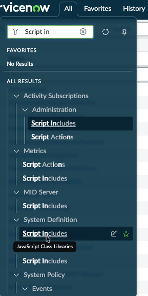
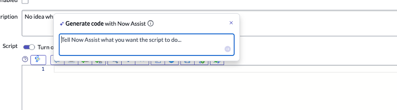

# Section 6.3 Code generation | World Forums and Summits Learning Labs 2026

For the complete documentation index, see [llms.txt](https://servicenow-events-or-lab-guidebo.gitbook.io/world-forums-learning-labs-2026/llms.txt). This page is also available as [Markdown](section-6.3-code-generation.md).

1. **Go to All > System Definition > Script Includes.** A script is a reusable server-side script that provides logic to define a function or class.

1. Select **New** in the upper right-hand corner.

1. Close any popups that appear, then give the Script Include a Name (e.g., ***[Your initials] Test Script) and a Description of “My first test script”.***

1. Replace the default code with the following:

1. Now, **hit CMD + Return (Mac) or CTRL + ENTER (Windows)**

This feature allows you to use Now Assist to write a custom script based on your instructions.

6. When you are finished, click **Submit**

**Congratulations,** you have completed the Now Assist for the Developer persona portion of the lab!

[PreviousSection 6.2 Flow Generation](section-6.md)[NextSection 7. Now Assist Skill Kit (OPTIONAL)](../section-7.md)

Last updated 5 months ago
