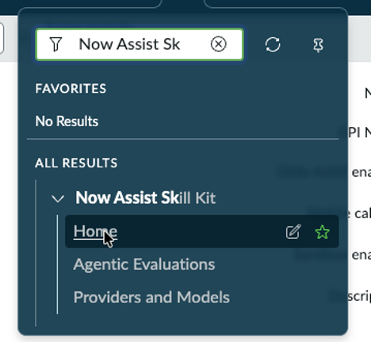

# Section 7. Now Assist Skill Kit (OPTIONAL) | World Forums and Summits Learning Labs 2026

For the complete documentation index, see [llms.txt](https://servicenow-events-or-lab-guidebo.gitbook.io/world-forums-learning-labs-2026/llms.txt). This page is also available as [Markdown](section-7.-now-assist-skill-kit-optional.md).

Go to the following community site and familiarize yourself with the NASK features

Visit the following URL to see SEVERAL use cases that work with this lab setup

[ServiceNow Community Article: Now Assist Skill Kit Use Case Library](https://www.servicenow.com/community/now-assist-articles/now-assist-skill-kit-use-case-library/ta-p/3053580)

Congratulations, you have completed the lab!

[PreviousSection 6.3 Code generation](section-6.-now-assist-for-the-developer-persona/section-6.md)[NextSection 8. Triage Agent - Assignment Group Selector (OPTIONAL)](section-8.md)

Last updated 5 months ago
