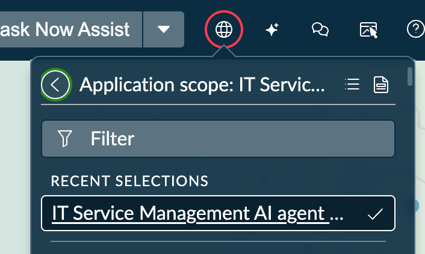
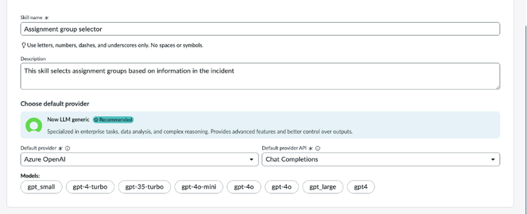
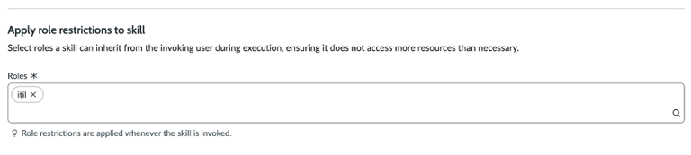
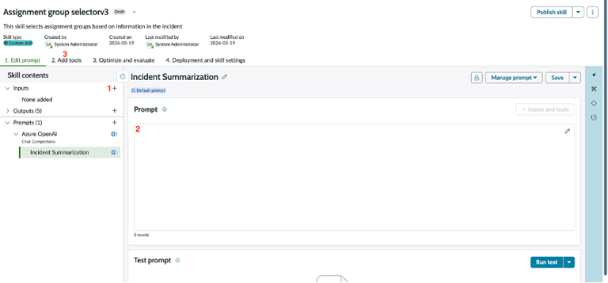

# Section 8.1 - Now Assist Skill Kit

In this exercise, you will create a custom Now Assist Skill Kit (NASK) skill that predicts the most appropriate assignment group for an incident.

## Create the Skill

Before you begin, verify that you are in the **IT Service Management AI Agent Collection** application scope.




You may create a test incident using the `incident.list` table if desired. However, demo data is already available in the lab instance and can be used for testing.


1. Navigate to:

   `Now Assist Skill Kit > Home`

2. Create a new skill using the following values.

   | Field | Value |
   |---------|---------|
   | Skill name | Campus Support Routing Assistant |
   | Description | This skill analyzes campus technology incidents and predicts the support team best equipped to resolve the issue |
   | Default provider | Azure OpenAI |
   | Default provider API | Chat Completions |


3. Scroll down to **Apply role restrictions to skill**.

4. Add the following role:

   ```text
   itil
   ```





5. Select **Skip to Prompt Editor**.


You could follow the guided prompt setup process, but for this lab we will save time by jumping directly to the Prompt Editor.


## Configure the Skill

6. Begin building the skill.



### Add an Input

7. Select **+** to add an input.

8. Configure the input using the following values.

   | Field | Value |
   |---------|---------|
   | Data type | String |
   | Name | incidentnumber |

Use **incidentnumber** as a single word.

### Add the Prompt

9. Add the following prompt.

Notice the references enclosed in double braces (`{{ }}`). These values will be populated by tools you add later.

   ```text
   You are an IT Service Management incident triage classifier. Your task is to
   analyze a single incident and select the most appropriate assignment group
   from a provided candidate list. You must return your answer as strict JSON.
   
   ## Incident
   
   Short Description:
   {{LookupIncident.output.short_description}}
   
   Description:
   {{LookupIncident.output.description}}
   
   ## Candidate assignment groups
   
   The following JSON array contains every group that may receive this incident.
   Each item has a sys_id, a name, and a description of the group's
   responsibilities.
   
   {{assignmentgroup.output}}
   
   ## Campus Technology Context
   
   Many incidents may originate from students, faculty, researchers, or staff at a university.
   
   Common higher education technology services include:
   
   - Learning Management Systems (Canvas, Blackboard, Moodle)
   - Video and classroom collaboration platforms
   - Microsoft 365 services
   - Identity and access management systems
   - Research computing resources
   - Administrative applications
   - Classroom technology
   
   When evaluating incidents involving higher education technology services:
   
   - Focus on the underlying technology issue rather than the individual reporting the issue.
   - Use only the assignment groups provided in the candidate list.
   - Do not invent assignment groups.
   - Match the incident to the assignment group whose responsibilities most closely align with the affected technology or service.
   
   Examples:
   
   - Canvas access problems, gradebook issues, course delivery issues, assignment submission failures, or learning platform outages should be routed to the group responsible for software applications, enterprise applications, business applications, or application support if such a group exists.
   - Microsoft 365 issues, collaboration platform issues, and productivity application issues should be routed to the group responsible for software or application support if such a group exists.
   - Account lockouts, authentication failures, password resets, or access requests should be routed to the group responsible for identity, access, or service desk functions if such a group exists.
   - Laptop, desktop, classroom device, projector, printer, or peripheral failures should be routed to the group responsible for hardware support if such a group exists.
   - Network, wireless, VPN, internet connectivity, or communication issues should be routed to the group responsible for network support if such a group exists.
   
   ## How to choose
   
   1. Read the short description and description together to identify:
      - The affected service, system, or technology.
      - The type of work required.
      - Any location or scope signals.
   
   2. For each candidate group, weigh how well its name and description align with the incident. Prefer the most specialized group whose responsibilities explicitly cover the issue. Avoid generic catch-all groups unless no specialist group fits.
   ```

10. Go to the “Add tools” tab to add tools. 

In the tool editor we need to add two tools. For this exercise we will use script tools that are the fastest to add, however in a deployment we would rather recommend using a flow action or sub flows as these are easier to maintain and test.

