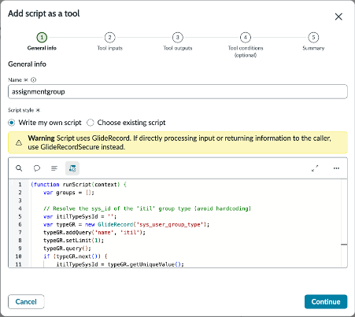
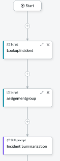

# NASK Tool 2: Lookup assignment groups | World Forums and Summits Learning Labs 2026

## nask-tool-2-lookup-assignment-groups.md

> For the complete documentation index, see [llms.txt](https://servicenow-events-or-lab-guidebo.gitbook.io/world-forums-learning-labs-2026/llms.txt). Markdown versions of documentation pages are available by appending `.md` to page URLs; this page is available as [Markdown](https://servicenow-events-or-lab-guidebo.gitbook.io/world-forums-learning-labs-2026/world-forums-and-summits-learning-labs/put-ai-to-work-shop-for-service-operations/section-8.-triage-agent-assignment-group-selector-optional/section-8.1-now-assist-skill-kit/nask-tool-2-lookup-assignment-groups.md).

## NASK Tool 2: Lookup assignment groups

Following the previous steps to add another script tool, this time name it \*\*assignmentgroup\*\*:

```javascript
(function runScript(context) {
var groups = [];
// Resolve the sys\_id of the 'itil' group type (avoid hardcoding)
var itilTypeSysId = '';
var typeGR = new GlideRecord('sys\_user\_group\_type');
typeGR.addQuery('name', 'itil');
typeGR.setLimit(1);
typeGR.query();
if (typeGR.next()) {
itilTypeSysId = typeGR.getUniqueValue();
}
// Query: active=true AND (type IS EMPTY OR type CONTAINS itil)
var gr = new GlideRecord('sys\_user\_group');
gr.addActiveQuery();
var qc = gr.addNullQuery('type');
if (itilTypeSysId) {
qc.addOrCondition('type', 'CONTAINS', itilTypeSysId);
}
gr.query();
while (gr.next()) {
groups.push({
sys\_id: gr.getUniqueValue(),
name: gr.getValue('name') || '',
description: gr.getValue('description') || ''
});
}
return JSON.stringify(groups);
})(context);
```

Configuration should now look like this:




Again, no other configuration is needed select continue until you have added the tool. Your flow should look similar to the image below. The exact order does not matter as both scripts will execute prior to the prompt.




To control, check back with your prompt, the \{{inputs\}} should be blue indicating that they are matched with the tools you have added.


