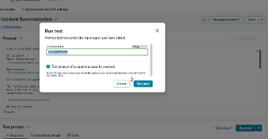
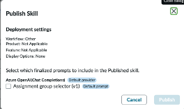
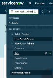
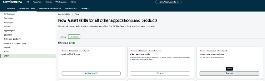

# Section 8.2 - Test, Finalize, and Publish Your Skill

Before using the skill in an AI Agent, validate the output and publish the skill so it becomes available within the platform.

## Test the Skill

1. In the Prompt Editor, scroll down and click **Run Test**.

2. Enter an incident number to test the skill.

   Example:

   ```text
   INC0099969
   ```

   For this lab, imagine a faculty member reports Canvas assignments are not loading and students are unable to submit coursework.

3. Click **Run Test** again.

   

4. Review the generated output. The exact assignment group returned will vary based on the assignment groups available in your instance.

   Example:

   ```json
   {
     "name": "Predicted Assignment Group",
     "sys_id": "Group Sys ID",
     "confidence": "94%"
   }
   ```

5. Verify that the predicted assignment group is appropriate for the incident.

   For a Canvas-related issue, the skill should typically select a group whose responsibilities include software support, application support, enterprise applications, or learning technologies, depending on the assignment groups available in your instance.

6. Optionally test additional incidents to observe how the prediction changes based on incident content.

## Finalize the Prompt

7. Select the **Lock** icon to finalize the prompt.

   

## Publish the Skill

8. In the upper-right corner of the editor, click **Publish Skill**.

9. Select your skill from the dialog box and complete the publication process.


If you used a different skill name than the examples in this guide, the dialog may look slightly different. However, there should only be one newly created skill available for selection.


## Activate the Skill

10. Navigate to:

    `Now Assist Admin > Skills`

    

11. Locate your skill in the skills list.

12. If no additional skills have been created, the skill will typically appear in the **Other** section.

13. Activate the skill.

    

## Completion

Congratulations. Your skill has been published and is now available for use in AI Agents.
