# Add AI Agent to Agentic Workflow

In this exercise, you will create a custom AI Agent that uses the assignment group prediction skill, updates the incident record, and documents its actions in the incident work notes.

## Create the AI Agent

1. Return to the **Define Key Requirements** section of the Agentic Workflow.

   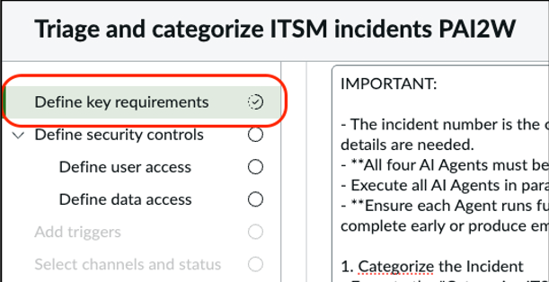

2. Under **Add AI Agents**, click **Create New AI Agent**.

   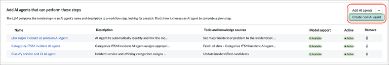

3. Configure the AI Agent using the following values.

   | Field | Value |
   |---|---|
   | AI Agent Name | Determine Assignment Group AI Agent |

### AI Agent Description

```text
This agent streamlines incident management by intelligently assigning incidents to the most appropriate support group. It fetches incident data, predicts the best assignment group using an AI skill, and ensures accuracy by requesting user confirmation for low-confidence predictions.
```

### AI Agent Role

```text
You specialize in automatically determining and setting the correct assignment group for newly created incidents. You retrieve incident details, utilize a predictive skill to suggest an assignment group with a confidence score, and seek user confirmation if the confidence score is below a predefined threshold before applying the assignment.
```

### List of Steps

```text
1. Use the provided incident number in calling tools in this AI Agent.
2. Predict the Assignment Group for the incident number.
3. Evaluate the confidence score returned by the assignment group selector.
4. If the confidence score is less than 80%, ask the user for confirmation to set the predicted assignment group.
5. If the confidence score is 80% or higher, or if the user confirms, assign the incident to the predicted assignment group using the "Assign incident to found assignment group" tool.
6. Write a summary of the steps executed in this AI Agent and save it to the work notes of the incident.
```

4. Click **Save and Continue**.

   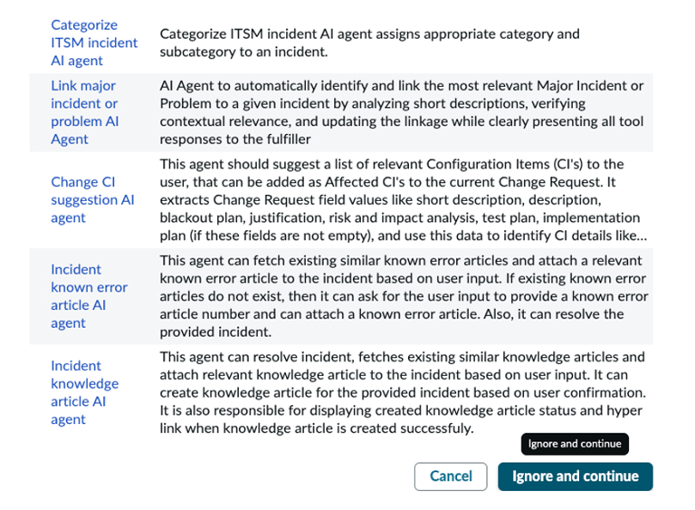

5. If potential duplicates are found, select **Ignore and Continue**.

## Add the Assignment Group Prediction Skill

6. In the **Tools and Information** section, click:

   **Add Tool → Now Assist Skill**

   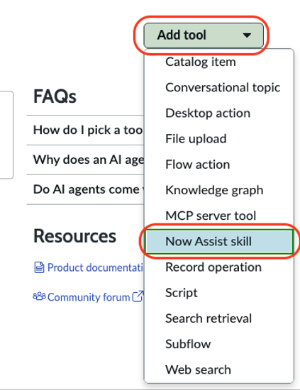

7. Select the NASK skill created earlier.

   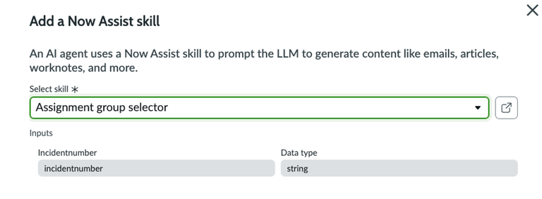


If you cannot find your skill, verify that it has been published in Now Assist Skill Kit and activated in the Now Assist Admin Console.


8. Configure the tool using the following values.

   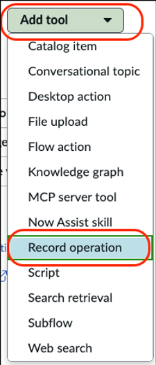

   | Field | Value |
   |---|---|
   | Name | Assignment Group Selector |
   | Tool Description | This tool will predict the right assignment group for the incoming incident |
   | Execution Mode | Autonomous |
   | Display Output | No |

9. Click **Add**.

## Add the Incident Update Tool

10. Add another tool.

    **Add Tool → Record Operation**

11. Configure the tool using the following values.

   | Field | Value |
   |---|---|
   | Name | Update Incident |
   | Tool Description | Update incident |
   | Table | Incident |
   | Operation | Update Records |
   | Execution Mode | Autonomous |
   | Display Output | No |

### Input Parameters

   | Input Name | Description |
   |---|---|
   | incident_number | The incident number |
   | assignment_group | The sys_id of the assignment group |

### Conditions

12. Add the following condition:

| Field | Operator | Value |
|---|---|---|
| Active | Is | True |

13. Click **And** to add a second condition.

   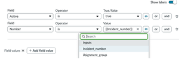

14. Configure the second condition.

| Field | Operator | Value |
|---|---|---|
| Number | Is | {{incident_number}} |


Use the input picker to reference variables such as the incident number.


### Field Values

| Field | Value |
|---|---|
| Assignment Group | {{assignment_group}} |

15. Click **Add**.

## Add the Work Notes Tool

16. Add another tool.

    **Add Tool → Script**

   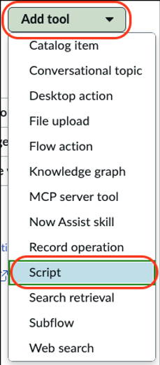

17. Configure the tool using the following values.

| Field | Value |
|---|---|
| Name | Update Incident Worknotes |
| Tool Description | This tool updates the incident worknotes |
| Execution Mode | Autonomous |
| Display Output | No |

### Input Parameters

| Input Name | Description |
|---|---|
| incident_number | The incident number |
| worknotes | The work notes to be added to the incident |

### Script

```javascript
(function(inputs) {
    var incidentNumber = inputs.incident_number;
    var worknotes = inputs.worknotes;

    var gr = new GlideRecord('incident');
    gr.addQuery('number', incidentNumber);
    gr.query();

    if (gr.next()) {
        gr.work_notes = worknotes;
        gr.update();

        return {
            status: 'success',
            incident_number: incidentNumber,
            incident_sys_id: gr.getUniqueValue(),
            message: 'Work notes updated successfully on incident ' + incidentNumber
        };
    } else {
        return {
            status: 'error',
            incident_number: incidentNumber,
            message: 'No incident found with number ' + incidentNumber
        };
    }
})(inputs);
```

18. Click **Save and Continue**.

## Configure Security

19. Configure user access.

| Setting | Value |
|---|---|
| User Access | Any Authenticated User |

20. Click **Save and Continue**.

21. Configure data access.

| Setting | Value |
|---|---|
| User Identity Type | AI User |
| AI User | itsm.aia.worker1 |

    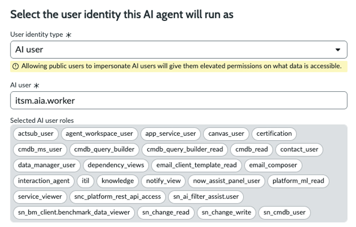

22. Click **Save and Continue**.

## Configure Availability

23. No triggers are required.

24. Click **Save and Continue**.

   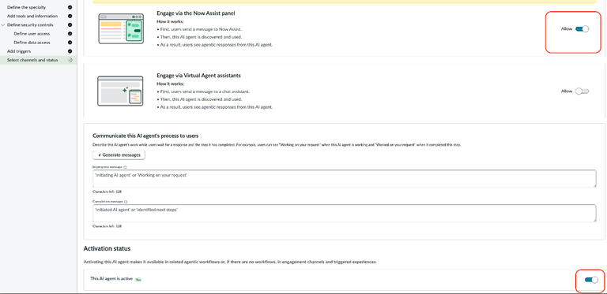

25. In **Select Channels and Status**, configure the following settings:

   | Setting | Value |
   |---|---|
   | Engage via the Now Assist Panel | On |
   | AI Agent Status | Active |

26. Save the AI Agent and add it to the Agentic Workflow.

   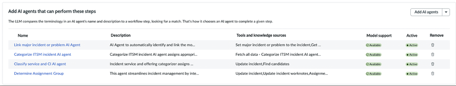

## Verify the Workflow

27. Confirm that the Agentic Workflow now contains an additional AI Agent for assignment group prediction.

## Completion

Congratulations. You successfully added a custom AI Agent to the Agentic Workflow.

The workflow can now determine assignment groups, update incidents automatically, and document the result in work notes.