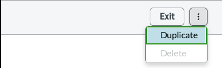
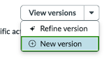

# Duplicate OOTB Agentic Workflow

In this exercise, you will create a copy of the out-of-the-box (OOTB) **Triage and Categorize ITSM Incidents** Agentic Workflow so that it can be modified and extended with a custom AI Agent.

## Duplicate the Workflow

1. Return to the Agentic Workflow.

   You can do this in one of two ways:

   - Open the workflow from the **Create and Manage** tab.
   - If you are still in the testing console, click **Edit Workflow**.

   

2. In the upper-right corner of the workflow, click the **three-dot menu**.

3. Select **Duplicate**.

4. Provide a name for the new workflow.

   Use any name you prefer.

## Update the Workflow Description

5. Replace the workflow description with the following text.

   ```text
   This agentic workflow enables campus technology teams to automatically classify technology issues, identify affected services, determine the most appropriate support team, and identify related incidents or known problems.
   ```

## Update the Workflow Steps

6. Update the workflow steps so that an additional AI Agent can be executed as part of the process.

7. Replace the existing workflow instructions with the following:

   ```text
   IMPORTANT:

   - The incident number is the only input required from the fulfiller — no other details are needed.
   - All four AI Agents must be executed — none should be skipped.
   - Execute all AI Agents in parallel, since there are no dependencies between them.
   - Ensure each Agent runs fully and independently, even if previous Agents complete early or produce empty results.

   1. Categorize the Incident
      - Execute the "Categorize ITSM Incident AI Agent" agent.
      - Purpose: Identify the appropriate category and sub-category based on incident details.

   2. Classify Service, Offering, and CI
      - Execute the "Classify Service and CI AI Agent" agent.
      - Purpose: Determine the correct service, service offering, and configuration item (CI) for the incident.

   3. Determine Campus Support Team
      - Execute the "Determine Assignment Group AI Agent" agent.
      - Purpose: Determine the correct support team for the incident.

   4. Link Major Incident or Problem
      - Execute the "Link Major Incident or Problem AI Agent" agent.
      - Purpose: Check for any related Major Incidents or Problems and link them to the current incident if a match is found.
   ```


The key change in this version of the workflow is the introduction of a new AI Agent responsible for determining the appropriate assignment group.


## Create a New Version

8. Create a new workflow version.

   | Setting | Value |
   |---|---|
   | Version | 2 |

   

## Save the Workflow

9. Click **Save and Continue**.

## Completion

Congratulations. You created a duplicate of the OOTB Agentic Workflow and prepared it for customization.

In the next exercise, you will add a custom AI Agent that predicts and applies assignment groups automatically.
