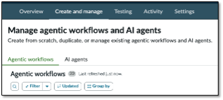
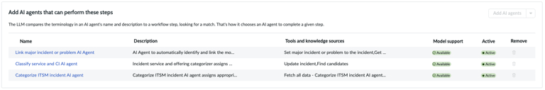
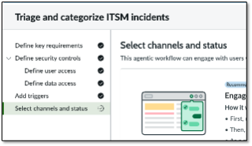
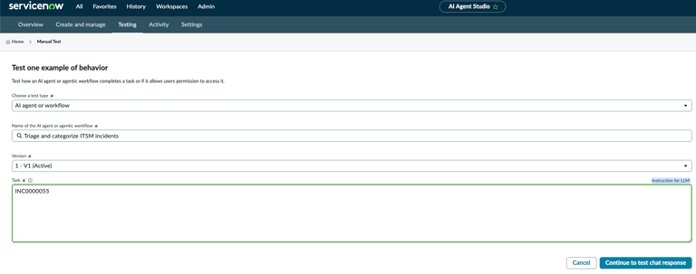
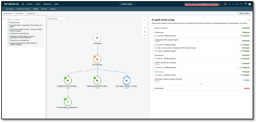

# Triage and Categorize ITSM Incidents

In this exercise, you will review the out-of-the-box (OOTB) **Triage and Categorize ITSM Incidents** Agentic Workflow, learn how it is constructed, and test its behavior before creating your own modified version.


## Open the Agentic Workflow

1. Open **AI Agent Studio**.

   Navigate to:

   `All > AI Agent Studio > Overview`

2. Review the AI Agent Studio home page.

   AI Agent Studio is the central workspace for building, maintaining, testing, and managing AI Agents and Agentic Workflows.

   

3. Select the **Create and Manage** tab.

4. Verify that the **Agentic Workflows** tab is selected.

## Review the OOTB Workflow

5. Locate and open the following Agentic Workflow:

   ```text
   Triage and Categorize ITSM Incidents
   ```

6. Notice that the workflow is marked **Read Only**.

   This indicates that the workflow was delivered out of the box as part of the ITSM AI Agents content pack.

7. Review the workflow definition.

   

8. Observe the key components of the workflow:

   - Workflow name
   - Workflow description
   - List of workflow steps
   - Associated AI Agents

9. Review the AI Agents included in the workflow.

10. Optionally open one of the AI Agents and examine its configuration.

    These AI Agents are also read-only because they were delivered as OOTB content.

## Review Workflow Configuration

11. Click **Continue** to move to the next section of the workflow configuration.

    

12. Review the remaining workflow sections:

    - Security controls
    - Triggers
    - Channels and status

13. Do not make any changes.

14. Continue through the workflow configuration until you reach the end.

## Test the Workflow

15. Click **Save and Test**.

16. Enter an incident number.

17. Click **Continue to Test Chat Response**.

    

18. Review the workflow execution.

19. Observe how the Agentic Workflow orchestrates multiple AI Agents.

    

20. Notice that multiple AI Agents are executed as part of a single workflow experience.

## What to Observe

| Area | Observation |
|---|---|
| Workflow orchestration | Multiple AI Agents can be executed by a single Agentic Workflow. |
| Read-only configuration | OOTB workflows and agents are protected from direct modification. |
| Testing experience | Agentic Workflows can be validated directly within the testing console. |
| AI Agent collaboration | Each AI Agent performs a specific task within the larger workflow. |

## Completion

Congratulations. You reviewed and tested the out-of-the-box **Triage and Categorize ITSM Incidents** Agentic Workflow.

In the next exercise, you will duplicate the workflow so that you can modify and extend its behavior.