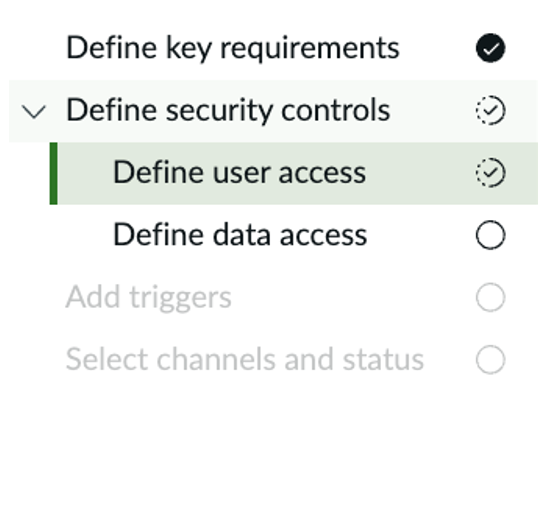
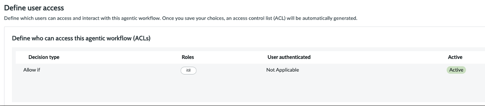
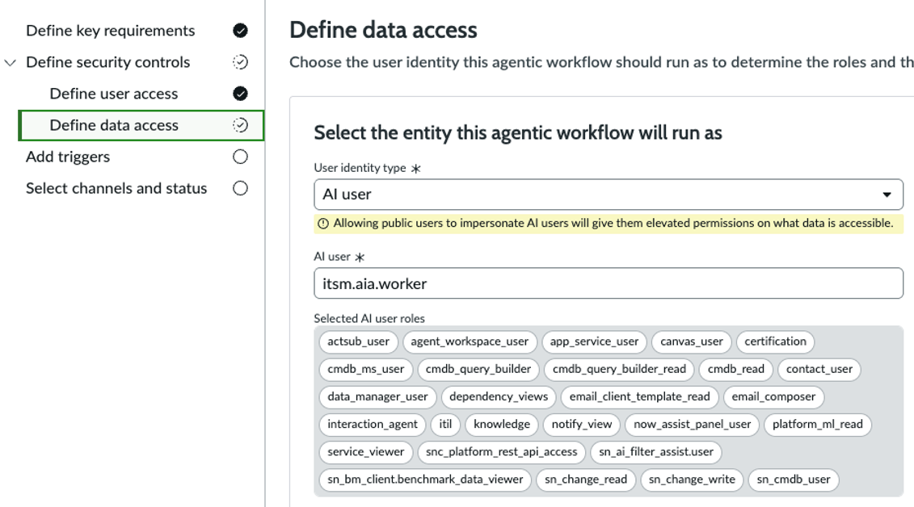
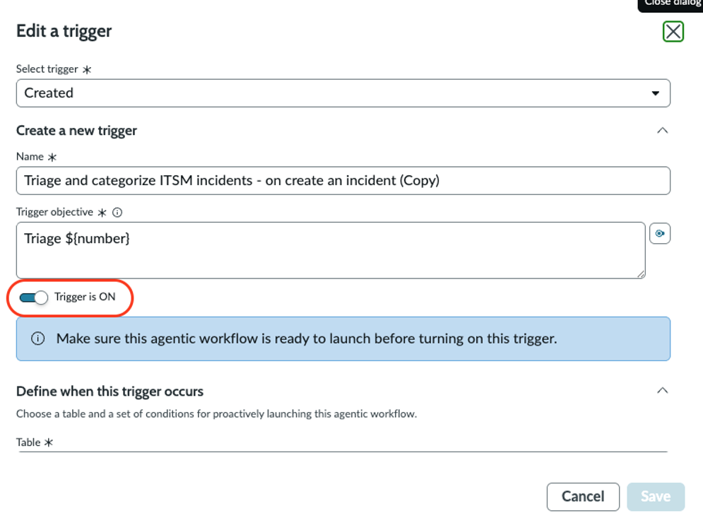
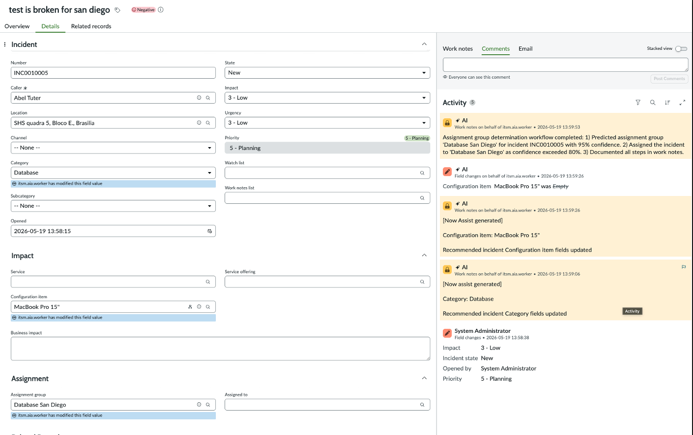

# section-8.4-finalize-and-test-the-agentic-workflow.md

## section-8.4-finalize-and-test-the-agentic-workflow.md

> For the complete documentation index, see [llms.txt](https://servicenow-events-or-lab-guidebo.gitbook.io/world-forums-learning-labs-2026/llms.txt). Markdown versions of documentation pages are available by appending `.md` to page URLs; this page is available as [Markdown](https://servicenow-events-or-lab-guidebo.gitbook.io/world-forums-learning-labs-2026/world-forums-and-summits-learning-labs/put-ai-to-work-shop-for-service-operations/section-8.-triage-agent-assignment-group-selector-optional/section-8.4-finalize-and-test-the-agentic-workflow.md).

## Section 8.4 Finalize and test the Agentic Workflow

The last settings before we can use the Agentic Workflow need to be made. Go through the following sections of the agentic workflow:\

\- Define security controls\
\- Add triggers\
\- Select channels and status

1\. Define security controls:\

a. Define user access: Allow if roles \*\*itil\*\*&#x20;

b. Define data access:\

i. \*\*User identity type\*\*: AI user\
ii. \*\*AI user\*\*: itsm.aia.worker&#x20;

2\. Activate the OOTB copy trigger, by selecting \*\*Trigger is ON\*\*:&#x20;

3\. Select channels and status: make sure \*\*Engage via the Now Assist Panel\*\* is switched on:&#x20;

4\. You can now \*\*Save and test\*\* the workflow. In order to test the workflow, you can either create an incident, or use an existing incident in testing mode. \\\

If everything is correct, you will see fields automatically being updated and worknotes being generated about what the AI Agents have been executing:&#x20;

\*Congratulations! You finsihed this lab section and created an Agentic Workflow including a custom AI Agent.\*
