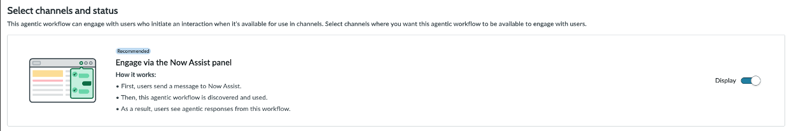

# Section 8.4 Finalize and test the Agentic Workflow | World Forums and Summits Learning Labs 2026

For the complete documentation index, see [llms.txt](https://servicenow-events-or-lab-guidebo.gitbook.io/world-forums-learning-labs-2026/llms.txt). This page is also available as [Markdown](section-8.4-finalize-and-test-the-agentic-workflow.md).

The last settings before we can use the Agentic Workflow need to be made. Go through the following sections of the agentic workflow:
- Define security controls
- Add triggers
- Select channels and status

1. Define security controls:
a. Define user access: Allow if roles **itil**

b. Define data access:
i. **User identity type**: AI user
ii. **AI user**: itsm.aia.worker

2. Activate the OOTB copy trigger, by selecting **Trigger is ON**:

3. Select channels and status: make sure **Engage via the Now Assist Panel** is switched on:

4. You can now **Save and test** the workflow.

In order to test the workflow, you can either create an incident, or use an existing incident in testing mode.
If everything is correct, you will see fields automatically being updated and worknotes being generated about what the AI Agents have been executing:

*Congratulations! You finsihed this lab section and created an Agentic Workflow including a custom AI Agent.*

[PreviousAdd AI Agent to Agentic Workflow](section-8.3-building-ai-agents/add-ai-agent-to-agentic-workflow.md)[NextAppendix](../appendix.md)

Last updated 2 days ago
